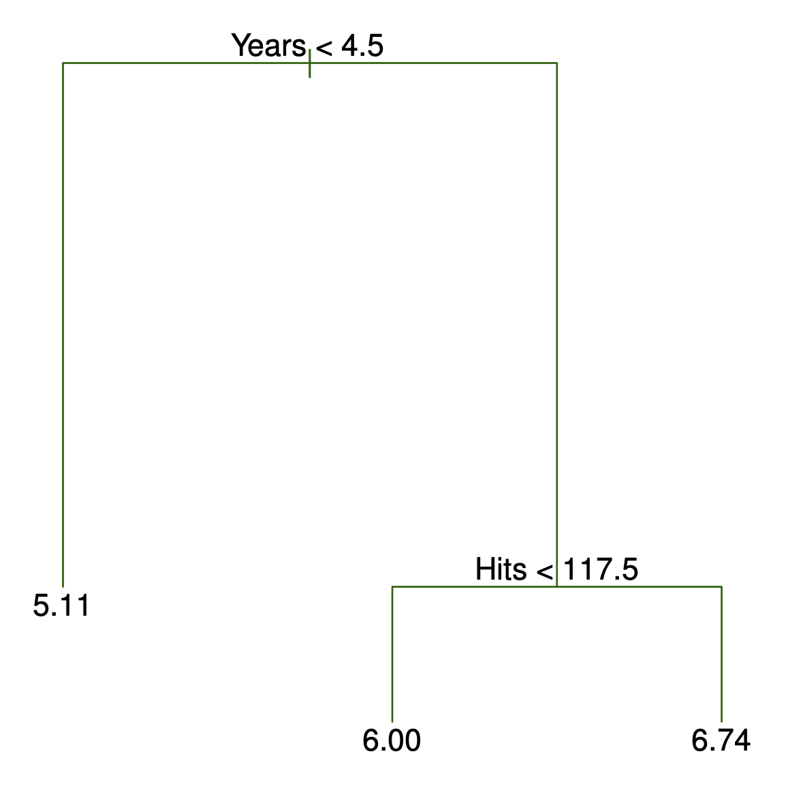
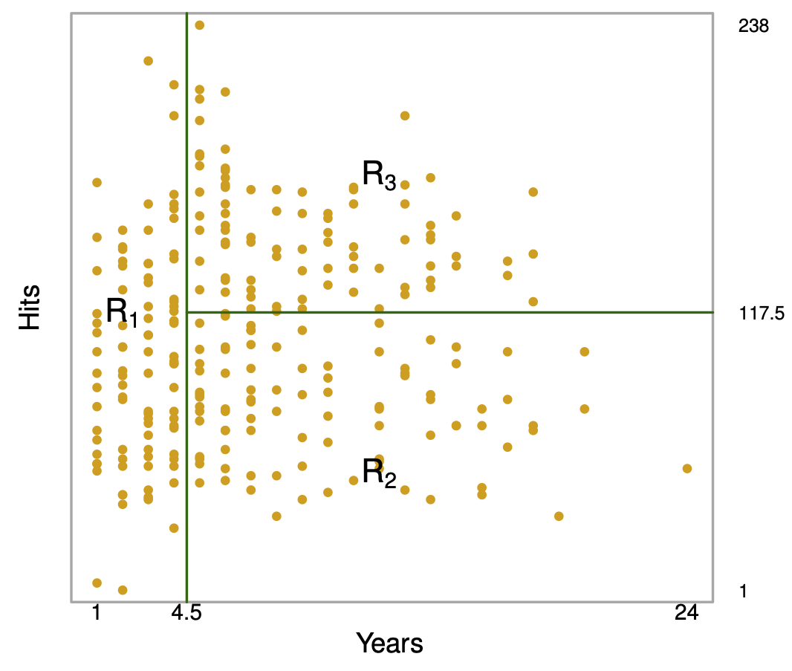
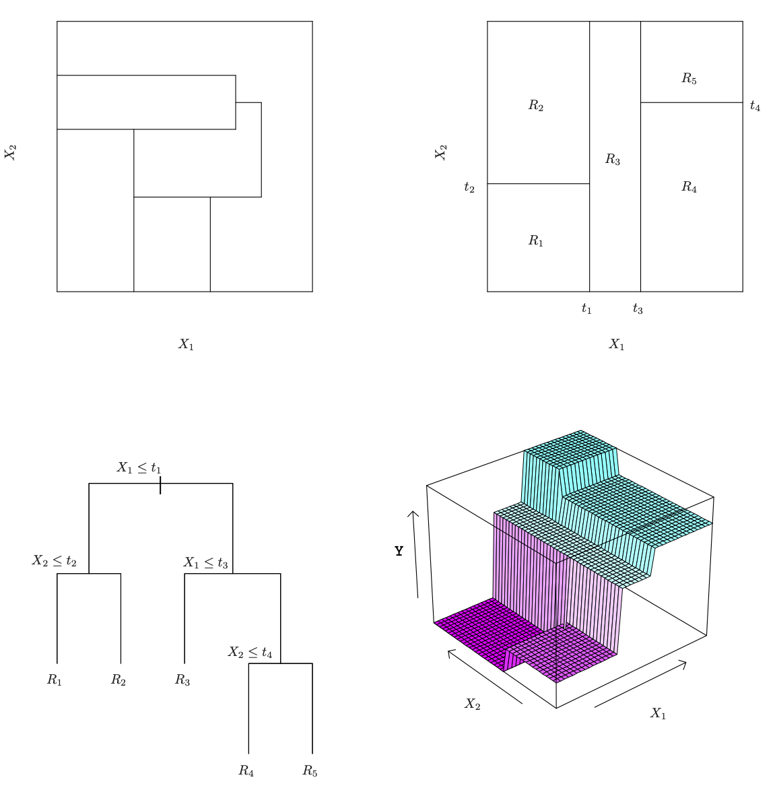
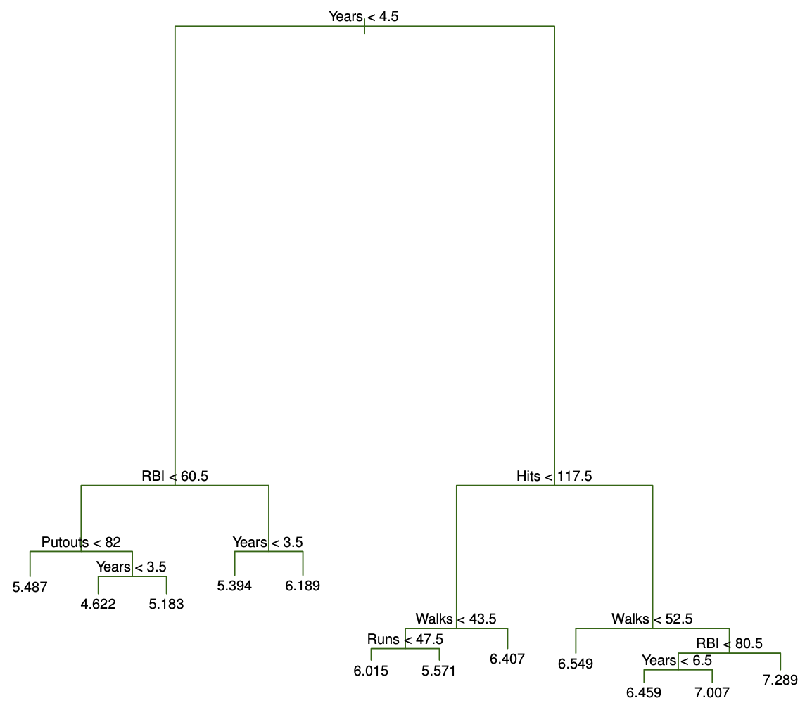
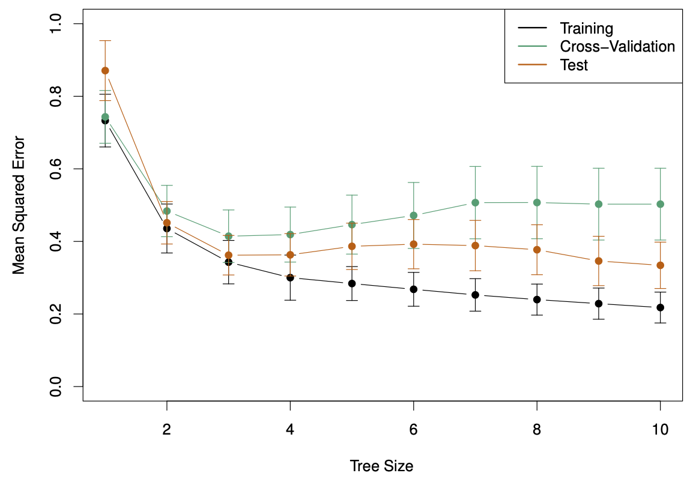
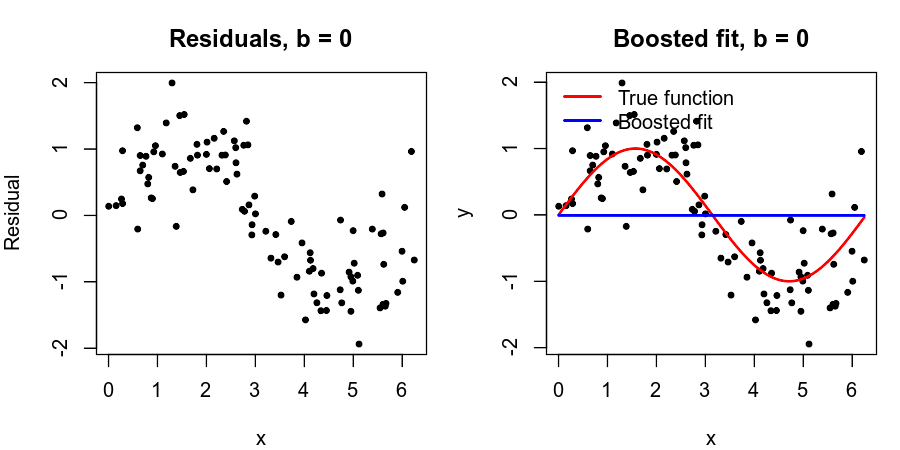
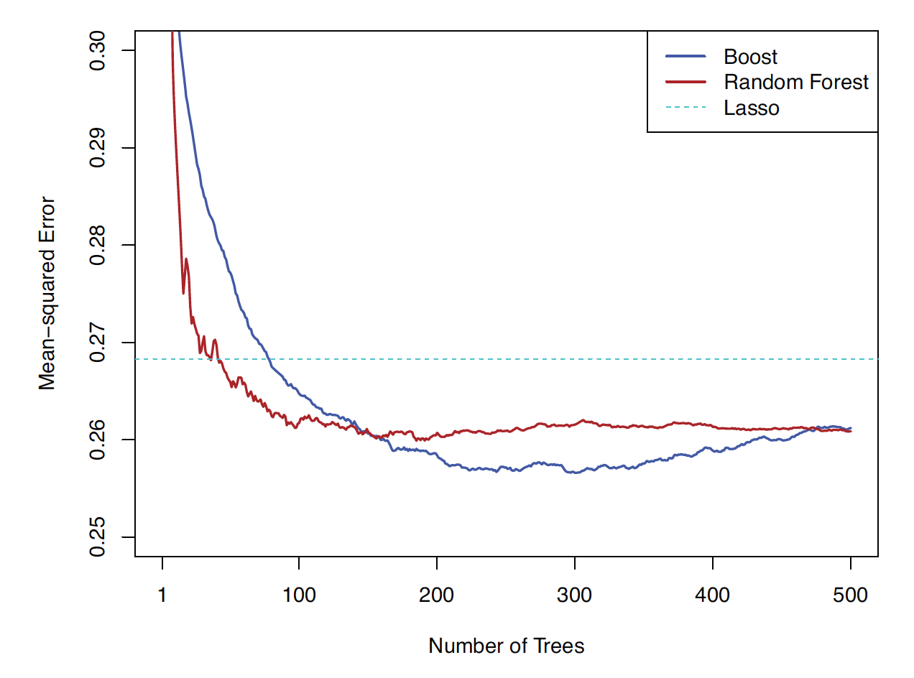
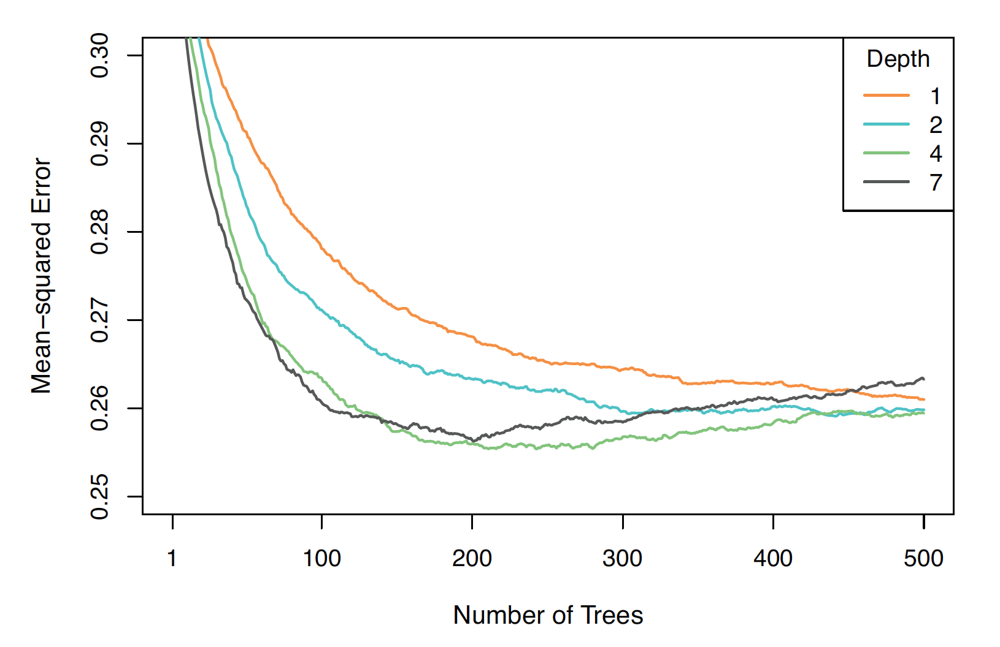
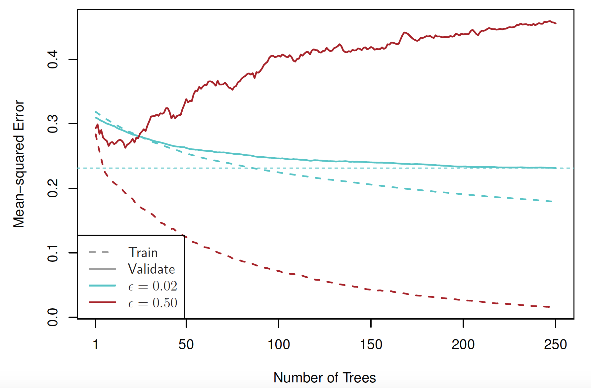

```{r}
#| warning: false
#| echo: false
#| include: false
#| message: false
#| purl: false
```


This unit will cover the following [topics]{.orange}:

-   Regression Trees
-   Bagging
-   Random Forests
-   Boosting

## Regression Trees

-  Tree-based methods involve [stratifying]{.orange} or [segmenting]{.orange} the predictor space into a number of simple regions.

- Since the set of splitting rules used to segment the
predictor space can be summarized in a tree, these types of
approaches are known as [decision-tree]{.orange} methods.

## Pros and Cons

- Tree-based methods are simple and useful for
interpretation.

-  However they typically are not competitive with the best
supervised learning approaches in terms of prediction
accuracy.

-  Hence we also discuss [bagging]{.blue}, [random forests]{.blue}, and
[boosting]{.blue}. These methods grow multiple trees which are
then combined to yield a single consensus prediction.

-  Combining a large number of trees can often result in
dramatic improvements in prediction accuracy, at the
expense of some loss interpretation.

## Baseball salary data: how would you stratify it?

Log Salary is color-coded from low (blue, green) to high (yellow,red)

```{r}
#| warning: false
#| message: false
#| fig-width: 5
#| fig-height: 4.5
library(ISLR2)
library(ggpubr)
Hitters <- na.omit(Hitters)
Hitters$Salary <- log(Hitters$Salary)
ggscatter(Hitters,
          x = "Years",
          y = "Hits",
          color = "Salary",
          palette = c("blue", "green", "yellow", "red"),
          size = 2,
          xlab = "Years",
          ylab = "Hits") +
  scale_color_gradientn(colors = c("blue", "green", "yellow", "red"))
```


## Decision tree for these data (ISL Figure 8.1)

{width="50%"}

## Details of previous figure

- For the Hitters data, a regression tree for predicting the log
salary of a baseball player, based on the number of years that he
has played in the major leagues and the number of hits that he
made in the previous year.

- At a given internal node, the label (of the form $X_j < t_k$ )
indicates the left-hand branch emanating from that split, and
the right-hand branch corresponds to $X_j \geq t_k$ . For instance, the
split at the top of the tree results in two large branches. The
left-hand branch corresponds to `Years`<4.5, and the right-hand
branch corresponds to `Years`>=4.5.

-  The tree has two internal nodes and three terminal nodes, or
leaves. The number in each leaf is the mean of the response for
the observations that fall there.

## Results (ISL Figure 8.2)

Overall, the tree stratifies or segments the players into
three regions of predictor space: $R_1 =\{X |$ `Years`<4.5 $\}$,
$R_2 =\{X |$ `Years`>=4.5, `Hits`<117.5 $\}$, and $R_3 =\{X |
$ `Years`>=4.5, `Hits`>=117.5 $\}$.

{width="80%"}

## Terminology for Trees

- In keeping with the tree analogy, the regions $R_1$, $R_2$, and
$R_3$ are known as [terminal nodes]{.orange}

-  Decision trees are typically drawn [upside down]{.blue}, in the
sense that the leaves are at the bottom of the tree.

-  The points along the tree where the predictor space is split
are referred to as [internal nodes]{.orange}

- In the hitters tree, the two internal nodes are indicated by
the text `Years`<4.5 and `Hits`<117.5.

## Interpretation of Results

- `Years` is the most important factor in determining `Salary`,
and players with less experience earn lower salaries than
more experienced players.

- Given that a player is less experienced, the number of `Hits`
that he made in the previous year seems to play little role
in his Salary.

- But among players who have been in the major leagues for
five or more years, the number of `Hits` made in the
previous year does affect `Salary`, and players who made
more `Hits` last year tend to have higher salaries.

- Surely an over-simplification, but compared to a regression
model, it is easy to display, interpret and explain


## Details of the tree-building process

- Partition the predictor space (all values of $X_1,\ldots,X_p$) into $J$ disjoint regions $R_1,\ldots,R_J$.

- In each region $R_j$, predict with a constant:
$$
\hat{y}_{R_j} = \frac{1}{|R_j|} \sum_{i \in R_j} y_i
$$

- Choose the regions to minimize the residual sum of squares (RSS):
$$
\sum_{j=1}^{J} \sum_{i \in R_j} (y_i - \hat{y}_{R_j})^2
$$

- In practice, exhaustively searching over all possible partitions is computationally infeasible. Instead,
  - restrict regions to [axis-aligned rectangles]{.blue}
  - build the partition using [recursive binary splitting]{.orange} (top-down, greedy)

- Interpretation:
  - each region = a group of similar observations  
  - prediction = average response within that group


## Recursive binary splitting

- [Top-down]{.orange}: start with the full dataset and successively split it into smaller regions.

- [Greedy]{.orange}: at each step, choose the split that gives the largest immediate reduction in RSS.

- At each step, select a predictor $X_j$ and split point $s$ that divides a region into:
$$
R_1(j,s) = \{X \mid X_j < s\}, \quad
R_2(j,s) = \{X \mid X_j \ge s\}.
$$

- Choose $(j,s)$ to minimize:
$$
\text{RSS}(j,s) =
\sum_{i \in R_1(j,s)} (y_i - \hat{y}_{R_1})^2 +
\sum_{i \in R_2(j,s)} (y_i - \hat{y}_{R_2})^2.
$$

- In practice:
  - sort each predictor
  - evaluate splits at [midpoints between consecutive values]{.blue}
  - select the split with smallest RSS

## Recursive binary splitting — continued

- After the first split, we obtain two regions $R_1$ and $R_2$.

- Next, we split [one of these regions]{.blue} further.

- For $R \in \{R_1, R_2\}$, define:
$$
R_L(j,s;R) = \{X \in R \mid X_j < s\}, \quad
R_R(j,s;R) = \{X \in R \mid X_j \ge s\}.
$$

- Choose $R$, $j$, and $s$ to minimize the [total RSS after the split]{.orange}:

$$\sum_{i \in R_L(j,s;R)} (y_i - \hat{y}_L)^2
+
\sum_{i \in R_R(j,s;R)} (y_i - \hat{y}_R)^2
+
\sum_{i \in R^c} (y_i - \hat{y}_{R^c})^2,$$ where $R^c$ is the region not split.

- Repeat until a stopping rule is met (e.g., minimum node size).


## Baseball example 

```{r}
#| warning: false
#| message: false
#| fig-width: 5
#| fig-height: 4.5

library(ISLR2)
Hitters <- na.omit(Hitters)

# Keep only variables of interest
df <- Hitters[, c("Years", "Hits", "Salary")]
df$Salary <- log(df$Salary)

# RSS for one split s
rss_split <- function(s, x, y) {
  left <- y[x < s]
  right <- y[x >= s]
  if (length(left) == 0 || length(right) == 0) return(Inf)
  sum((left - mean(left))^2) + sum((right - mean(right))^2)
}

# Helper to get all midpoint splits and RSS for a variable
all_splits <- function(x, y, var) {
  u <- sort(unique(x))
  splits <- (u[-1] + u[-length(u)]) / 2
  rss_vals <- sapply(splits, rss_split, x = x, y = y)
  data.frame(predictor = var, split = splits, RSS = rss_vals)
}

# Evaluate splits for both predictors
res_years <- all_splits(df$Years, df$Salary, "Years")
res_hits  <- all_splits(df$Hits,  df$Salary, "Hits")

results1 <- rbind(res_years, res_hits)
results1
```


## Baseball example continued

```{r}
#| warning: false
#| message: false
#| fig-width: 5
#| fig-height: 4.5
rss_vals <- results1$RSS[results1$predictor=="Years"]
split_vals <- results1$split[results1$predictor=="Years"]
best_s <- split_vals[which.min(rss_vals)]
plot(split_vals, rss_vals, type = "b",
     xlab = "Years",
     ylab = "RSS")
abline(v = best_s, col = "red", lwd = 2, lty = 2)
```

## Baseball example continued

```{r}
#| warning: false
#| message: false
#| fig-width: 5
#| fig-height: 4.5
x1 <- df$Years

left  <- x1 < best_s
right <- x1 >= best_s

left_mean  <- mean(df$Salary[left])
right_mean <- mean(df$Salary[right])

n_left  <- sum(left)
n_right <- sum(right)

cat(sprintf("Left region (Years < %.2f): n = %d, mean log-Salary = %.3f\n",
            best_s, n_left, left_mean))

cat(sprintf("Right region (Years >= %.2f): n = %d, mean log-Salary = %.3f\n",
            best_s, n_right, right_mean))

cat("\nInterpretation:\n")
cat(sprintf("The split at Years = %.2f creates two regions.\n", best_s))
cat(sprintf("The left region contains %d players and is assigned the prediction %.3f.\n",
            n_left, left_mean))
cat(sprintf("The right region contains %d players and is assigned the prediction %.3f.\n",
            n_right, right_mean))
cat("Because the response is log(Salary), these are predicted mean log-salaries in the two regions.\n")
```

## Baseball example continued

```{r}
#| warning: false
#| message: false
#| fig-width: 5
#| fig-height: 4.5
cols <- ifelse(df$Years < best_s, "blue", "darkgreen")

plot(df$Years, df$Salary,
     col = cols,
     pch = 19,
     xlab = "Years",
     ylab = "log Salary",
     main = paste("Best split at Years =", round(best_s, 2)))

abline(v = best_s, col = "red", lwd = 2, lty = 2)

segments(min(df$Years), left_mean, best_s, left_mean,
         col = "blue", lwd = 3)
segments(best_s, right_mean, max(df$Years), right_mean,
         col = "darkgreen", lwd = 3)
```

## Baseball example continued

```{r}
#| warning: false
#| message: false
#| fig-width: 6
#| fig-height: 5

# Regions produced by the first split on Years
R1 <- df[df$Years < best_s, ]
R2 <- df[df$Years >= best_s, ]

# RSS for an unsplit region
region_rss <- function(y) {
  sum((y - mean(y))^2)
}

# Compute all candidate second splits within a region
get_splits_region <- function(data, region_name) {
  out <- NULL
  
  for (pred in c("Years", "Hits")) {
    x <- data[[pred]]
    y <- data$Salary
    
    u <- sort(unique(x))
    if (length(u) < 2) next
    
    splits <- (u[-1] + u[-length(u)]) / 2
    rss_vals <- sapply(splits, rss_split, x = x, y = y)
    
    tmp <- data.frame(
      region = region_name,
      predictor = pred,
      split = splits,
      region_RSS = rss_vals
    )
    
    out <- rbind(out, tmp)
  }
  
  out
}

# All candidate second splits
res_R1 <- get_splits_region(R1, "Left")
res_R2 <- get_splits_region(R2, "Right")

results_second <- rbind(res_R1, res_R2)

# Total RSS after the second split:
# RSS of the split region + RSS of the region left unchanged
results_second$total_RSS <- NA_real_

results_second$total_RSS[results_second$region == "Left"] <-
  results_second$region_RSS[results_second$region == "Left"] +
  region_rss(R2$Salary)

results_second$total_RSS[results_second$region == "Right"] <-
  results_second$region_RSS[results_second$region == "Right"] +
  region_rss(R1$Salary)

# Sort from best to worst and display
#results_second <- results_second[order(results_second$total_RSS), ]
results_second

# Best second split
results_second <- results_second[order(results_second$total_RSS), ]
best_second <- results_second[1, ]

cat("Best second split:\n")
cat(sprintf("  Split the %s region\n", best_second$region))
cat(sprintf("  Predictor: %s\n", best_second$predictor))
cat(sprintf("  Split point: %.2f\n", best_second$split))
cat(sprintf("  Region RSS after split: %.3f\n", best_second$region_RSS))
cat(sprintf("  Total RSS after second split: %.3f\n", best_second$total_RSS))
```


## Predictions

- For a new observation, predict using the [mean response in its region]{.blue}.

- The model is a [piecewise-constant function]{.blue} over the predictor space.

- A five-region example of this approach is shown in the next
slide.

## ISL Figure 8.3

{width="80%"}

## Details of previous figure

- [Top Left]{.orange}: A partition of two-dimensional feature space that
could not result from recursive binary splitting.

- [Top Right]{.orange}: The output of recursive binary splitting on a
two-dimensional example.

- [Bottom Left]{.orange}: A tree corresponding to the partition in the top
right panel.

- [Bottom Right]{.orange}: A perspective plot of the prediction surface
corresponding to that tree.


## Pruning a tree

- The process described above may produce good predictions
on the training set, but is likely to [overfit]{.blue} the data, leading
to poor test set performance. [Why?]{.blue}

- A smaller tree with fewer splits (that is, fewer regions
$R_1,\ldots,R_J$ ) might lead to lower variance and better
interpretation at the cost of a little bias.

- One possible alternative to the process described above is
to grow the tree only so long as the decrease in the RSS
due to each split exceeds some (high) threshold.

- This strategy will result in smaller trees, but is too
[short-sighted]{.blue}: a seemingly worthless split early on in the
tree might be followed by a very good split — that is, a
split that leads to a large reduction in RSS later on.

## Pruning a tree - continued

- A better strategy is to grow a very large tree $T_0$, and then
[prune]{.orange} it back in order to obtain a [subtree]{.orange}

- [Cost complexity pruning]{.orange} — also known as [weakest link pruning]{.orange} — is used to do this

- we consider a sequence of trees indexed by a nonnegative
tuning parameter $\alpha$. For each value of $\alpha$ there corresponds
a subtree $T \subset T_0$ such that
$$\sum_{m=1}^{|T|} \sum_{i: x_i \in R_m}(y_i - \hat{y}_{R_m})^2 + \alpha |T|$$
is as small as possible. Here $|T|$ indicates the number of
terminal nodes of the tree $T$, $R_m$ is the rectangle (i.e. the
subset of predictor space) corresponding to the $m$th
terminal node, and $\hat{y}_{R_m}$ is the mean of the training
observations in $R_m$.

## Choosing the best subtree

- The tuning parameter $\alpha$ controls a trade-off between the
subtree’s complexity and its fit to the training data.

- We select an optimal value $\hat \alpha$ using cross-validation.

- We then return to the full data set and obtain the subtree
corresponding to $\hat \alpha$

## Summary: tree algorithm

1. Use recursive binary splitting to grow a large tree on the
training data, stopping only when each terminal node has
fewer than some minimum number of observations.

2. Apply cost complexity pruning to the large tree in order to
obtain a sequence of best subtrees, as a function of $\alpha$.

3. Use $K$-fold cross-validation to choose $\alpha$. For each
$k= 1,\ldots,K$:

   3.1 Repeat Steps 1 and 2 on the $\frac{K−1}{K}$ th fraction of the training data, excluding the $k$th fold.

   3.2 Evaluate the mean squared prediction error on the data in
the left-out kth fold, as a function of $\alpha$.
Average the results, and pick $\alpha$ to minimize the average
error.

## Baseball example continued

- First, we randomly divided the data set in half, yielding
132 observations in the training set and 131 observations in
the test set.

-  We then built a large regression tree on the training data
and varied $\alpha$ in in order to create subtrees with different
numbers of terminal nodes.

- Finally, we performed six-fold cross-validation in order to
estimate the cross-validated MSE of the trees as a function
of $\alpha$.

4. Return the subtree from Step 2 that corresponds to the
chosen value of $\alpha$.

## Baseball example continued (ISL Figure 8.4)

{width="80%"}

## Baseball example continued (ISL Figure 8.5)

{width="80%"}

## Advantages and Disadvantages of Trees

-  Trees are very easy to explain to people. In fact, they are
even easier to explain than linear regression!

- Some people believe that decision trees more closely mirror
human decision-making than do the regression approach seen in previous chapters.

-  Trees can be displayed graphically, and are easily
interpreted even by a non-expert (especially if they are
small).

- Trees can easily handle qualitative predictors without the
need to create dummy variables.

- Unfortunately, trees generally do not have the same level of
predictive accuracy as some of the other regression and
classification approaches seen in this book.

However, by aggregating many decision trees, the predictive
performance of trees can be substantially improved. We
introduce these concepts next.


## ALS data

* These data concern amyotrophic lateral sclerosis (Lou Gerig's disease).
There are 1822 observations ($n=1197$ training set and $625$ test set) on individuals with ALS. See  [Kuffner et al. Nature Biotechnol. 33, 51–57; 2015](https://lmackey.github.io/papers/als-nbt14.pdf)

* The goal is to predict the rate of progression `dFRS` of a functional rating score, using $p=369$ predictors based on measurements (and derivatives of these) obtained from patient visits.

* These data can be read directly into R via the command


```{r}
#| warning: false
#| message: false
#| echo: true
#| eval: false
als <- read.table("http://hastie.su.domains/CASI_files/DATA/ALS.txt",header=TRUE)
```


## 

```{r}
#| warning: false
#| message: false
#| fig-width: 6
#| fig-height: 5
rm(list=ls())
#als <- read.table("http://hastie.su.domains/CASI_files/DATA/ALS.txt",header=TRUE)

als <- read.csv("~/Downloads/ALS.txt", sep="")

# --- Data split ---
train_data <- als[als$testset == TRUE,  -1]
test_data  <- als[als$testset == FALSE, -1]

# --- Load library ---
library(tree)

# --- Fit decision tree ---
tree_model <- tree(dFRS ~ ., data = train_data)

plot(tree_model)

# --- Cross-validation for pruning ---
set.seed(123)
cv_results <- cv.tree(tree_model)

# Plot CV deviance vs tree size
plot(cv_results$size, cv_results$dev,
     type = "b",
     xlab = "Tree Size",
     ylab = "Deviance",
     main = "Cross-Validation for Tree Pruning")

# --- Select optimal tree size ---
optimal_size <- cv_results$size[which.min(cv_results$dev)]

# --- Prune tree ---
pruned_tree <- prune.tree(tree_model, best = optimal_size)

# --- Visualize pruned tree ---
plot(pruned_tree)
text(pruned_tree, pretty = 0)

# --- Prediction on test set ---
yhat <- predict(pruned_tree, newdata = test_data)

# Plot predictions vs actual values
plot(yhat, test_data$dFRS,
     xlab = "Predicted",
     ylab = "Actual",
     main = "Predicted vs Actual")
abline(0, 1, col = 2)

# --- Compute MSE ---
mse <- mean((yhat - test_data$dFRS)^2)
print(paste("Test set MSE :", round(mse,4)))
```

## Bagging

- [Bootstrap aggregation]{.orange}, or [bagging]{.orange}, is a general-purpose
procedure for reducing the variance of a statistical learning
method; we introduce it here because it is particularly
useful and frequently used in the context of decision trees.

- Recall that given a set of $n$ independent observations
$Z_1,...,Z_n$, each with variance $\sigma^2$, the variance of the mean $Z$ of the observations is given by $\sigma^2/n$.

- In other words, [averaging a set of observations reduces
variance]{.blue}. Of course, this is not practical because we
generally do not have access to multiple training sets.

## Bagging - continued

- Instead, we can bootstrap, by taking repeated samples
from the (single) training data set.

- In this approach we generate $B$ different bootstrapped
training data sets. We then train our method on the $b$th
bootstrapped training set in order to get $\hat f^{*_b}(x)$, the
prediction at a point $x$. We then average all the predictions
to obtain
$$\hat f_{bag}(x) = \frac{1}{B} \sum_{b=1}^{B} \hat f^{*_b}(x).$$
This is called [bagging]{.orange}.

## Bagging the ALS data

```{r}
#| warning: false
#| message: false
#| fig-width: 6
#| fig-height: 5

library(randomForest)

set.seed(123)

ntree <- 50
p <- ncol(train_data) - 1

# -----------------------------
# Fit bagging model
# -----------------------------
bag_fit <- randomForest(
  dFRS ~ .,
  data = train_data,
  mtry = p,
  ntree = ntree,
  keep.forest = TRUE
)

# -----------------------------
# OOB MSE
# -----------------------------
bag_oob_mse <- bag_fit$mse

# -----------------------------
# Per-tree predictions (test)
# -----------------------------
bag_pred_all <- predict(
  bag_fit, 
  newdata = test_data, 
  predict.all = TRUE
)$individual

bag_pred_all <- as.matrix(bag_pred_all)

# -----------------------------
# Test MSE vs number of trees
# -----------------------------
bag_test_mse <- numeric(ntree)

for (b in 1:ntree) {
  bag_pred_b <- rowMeans(bag_pred_all[, 1:b, drop = FALSE])
  bag_test_mse[b] <- mean((test_data$dFRS - bag_pred_b)^2)
}

# -----------------------------
# Plot
# -----------------------------
plot(
  1:ntree, bag_test_mse,
  type = "l",
  lwd = 2,
  col = "black",
  xlab = "B (Number of Trees)",
  ylab = "MSE",
  main = "Bagging vs Pruned Regression Tree",
  ylim = range(c(bag_test_mse, bag_oob_mse, mse))
)

lines(1:ntree, bag_oob_mse, col = "blue", lwd = 2)

# Pruned tree test error (horizontal dashed line)
abline(h = mse, lty = 2, lwd = 2)

legend(
  "topright",
  legend = c(
    "Bagging Test Error",
    "Bagging OOB Error",
    "Pruned Tree Test Error"
  ),
  col = c("black", "blue", "black"),
  lwd = 2,
  lty = c(1, 1, 2),
  bty = "n"
)
```

## Details of previous figure

Bagging results for the ALS data.

* The test error (black) is shown as a function of
$B$, the number of bootstrapped training sets used.

* The dashed line indicates the test error resulting from a
single classification tree.

* The blue traces show the OOB error, which in this case is considerably higher

## Out-of-Bag Error Estimation

It turns out that there is a very straightforward way to
estimate the test error of a bagged model.

- Recall that the key to bagging is that trees are repeatedly
fit to bootstrapped subsets of the observations. One can
show that on average, each bagged tree makes use of
around two-thirds of the observations.


- The remaining one-third of the observations not used to fit
a given bagged tree are referred to as the out-of-bag (OOB)
observations.

- We can predict the response for the ith observation using
each of the trees in which that observation was OOB. This
will yield around $B/3$ predictions for the ith observation,
which we average.

- This estimate is essentially the LOO cross-validation error
for bagging, if $B$ is large.

## Boostrap Sample

* A bootstrap sample of size $n$ drawn from the training data is
$$(\tilde x_1, \tilde y_1), \ldots, (\tilde x_n, \tilde y_n),$$
where each pair $(\tilde x_i, \tilde y_i)$ is selected independently and with replacement, uniformly at random from the original dataset
$$(x_1, y_1), \ldots, (x_n, y_n),$$

* In a bootstrap sample of size $n$, some observations appear multiple times, while others are not selected. For a single draw, the probability that a specific observation is not chosen is $$1-\frac{1}{n}$$

* After $n$ draws (i.e., one bootstrap sample), the probability that a given observation is never selected is
$$\Big(1-\frac{1}{n}\Big)^n \approx \frac{1}{e} \approx 0.368$$
for large $n$. Thus, about 1/3 of the training observations are left out of a given bootstrap sample


## Variable Importance

* How can we measure variable importance?

* In bagging, and more generally random forests, a common approach is based on [permuting predictors]{.blue} using the out-of-bag (OOB) data. 

* For each tree, the prediction error on its OOB sample is computed (OOB MSE). Then, for a given predictor, its values are randomly permuted in the OOB data and the prediction error is recomputed. 

* The increase in prediction error due to this permutation is averaged over all trees, and often normalized by the standard deviation of these increases.

* This measures how much worse the model performs when the information in a variable is destroyed, i.e., it compares the model’s performance using the original variable versus a randomized version of it.

```{r}
#| warning: false
#| message: false
#| fig-width: 6
#| fig-height: 5

set.seed(123)
bag_fit <- randomForest(
  dFRS ~ .,
  data = train_data,
  mtry = p,
  ntree = ntree,
  importance = TRUE, 
)
varImpPlot(bag_fit, type=1)
```

## Random Forests

[Random forests]{.orange} provide an improvement over bagged trees
by way of a small tweak that [decorrelates]{.blue} the trees. This
reduces the variance when we average the trees.

* As in bagging, we build a number of decision trees on
bootstrapped training samples.

* But when building these decision trees, each time a split in
a tree is considered, [a random selection of $m$ predictors]{.blue} is
chosen as split candidates from the full set of $p$ predictors.
The split is allowed to use only one of those $m$ predictors.

* A fresh selection of $m$ predictors is taken at each split, and
typically we choose $m \approx \sqrt{p}$ — that is, the number of
predictors considered at each split is approximately equal
to the square root of the total number of predictors (19 out
of the 369 for the ALS data).


##


```{r}
#| warning: false
#| message: false
#| fig-width: 6
#| fig-height: 5

set.seed(123)

ntree <- 50
p <- ncol(train_data) - 1
m_rf <- floor(sqrt(p))

# Fit bagging model
bag_fit <- randomForest(
  dFRS ~ .,
  data = train_data,
  mtry = p,
  ntree = ntree,
  keep.forest = TRUE
)

# Fit random forest model
rf_fit <- randomForest(
  dFRS ~ .,
  data = train_data,
  mtry = m_rf,
  ntree = ntree,
  keep.forest = TRUE
)

# OOB MSE
bag_oob_mse <- bag_fit$mse
rf_oob_mse  <- rf_fit$mse

# Per-tree predictions on test set
bag_pred_all <- predict(bag_fit, newdata = test_data, predict.all = TRUE)$individual
rf_pred_all  <- predict(rf_fit,  newdata = test_data, predict.all = TRUE)$individual

# Make sure they are matrices
bag_pred_all <- as.matrix(bag_pred_all)
rf_pred_all  <- as.matrix(rf_pred_all)

# Test MSE as a function of number of trees
bag_test_mse <- numeric(ntree)
rf_test_mse  <- numeric(ntree)

for (b in 1:ntree) {
  bag_pred_b <- rowMeans(bag_pred_all[, 1:b, drop = FALSE])
  rf_pred_b  <- rowMeans(rf_pred_all[, 1:b, drop = FALSE])

  bag_test_mse[b] <- mean((test_data$dFRS - bag_pred_b)^2)
  rf_test_mse[b]  <- mean((test_data$dFRS - rf_pred_b)^2)
}

# Plot
plot(
  1:ntree, bag_test_mse,
  type = "l",
  lwd = 2,
  col = "black",
  xlab = "B (Number of Trees)",
  ylab = "MSE",
  ylim = range(c(bag_test_mse, rf_test_mse, bag_oob_mse, rf_oob_mse))
)

lines(1:ntree, rf_test_mse, col = "orange", lwd = 2)
lines(1:ntree, bag_oob_mse, col = "blue",   lwd = 2)
lines(1:ntree, rf_oob_mse,  col = "green",  lwd = 2)

legend(
  "topright",
  legend = c(
    "Bagging Test Error",
    "Random Forest Test Error",
    "Bagging OOB Error",
    "Random Forest OOB Error"
  ),
  col = c("black", "orange", "blue", "green"),
  lwd = 2,
  bty = "n"
)
```

## Boosting

* Recall that bagging involves creating multiple copies of the
original training data set using the bootstrap, fitting a
separate decision tree to each copy, and then combining all
of the trees in order to create a single predictive model.

* Notably, each tree is built on a bootstrap data set,
independent of the other trees.

* Boosting works in a similar way, except that the trees are
grown [sequentially]{.blue}: each tree is grown using information
from previously grown trees.

## Boosting algorithm for regression trees

1. Set $\hat f(x) = 0$ and $r_i = y_i$ for all $i$ iin the training set

2. For $b=1,\ldots,B$, repeat:

   2.1 Ft a tree $\hat f^b$ with $d$ splits ($d+1$ terminal nodes) to the training data $(X,r)$
   
   2.2 Update $\hat f$ by adding in a shrunken version of the new tree:
   
   $$\hat f(x) \leftarrow \hat f(x) + \lambda \hat f^b(x)$$
   2.3 Update the residuals
   
   $$r_i \leftarrow r_i - \lambda \hat f^b(x_i)$$

3. Output the boosted model,

$$\hat f(x) = \sum_{b=1}^{B} \lambda \hat f^b(x)$$

## Toy Example ($B=50, d=1, \lambda =0.01$)

{fig-align="center" width="100%"}


##   What is the idea behind this procedure?

Unlike fitting a single large decision tree to the data, which amounts to [fitting the data hard]{.blue} and potentially overfitting,
the boosting approach instead [learns slowly]{.blue}.

*  Given the current model, we fit a decision tree to the
residuals from the model. We then add this new decision
tree into the fitted function in order to update the
residuals.

*  Each of these trees can be rather small, with just a few
terminal nodes, determined by the parameter d in the
algorithm.

*  By fitting small trees to the residuals, we slowly improve $\hat f$ in areas where it does not perform well. The shrinkage
parameter $\lambda$ slows the process down even further, allowing
more and different shaped trees to attack the residuals.


## Tuning parameters for boosting

1. The [number of trees]{.orange} $B$. Unlike bagging and random forests,
boosting can overfit if $B$ is too large, although this
overfitting tends to occur slowly if at all. We use
cross-validation to select $B$.

2. The [shrinkage parameter]{.orange} $\lambda$, a small positive number. This
controls the rate at which boosting learns. Typical values
are 0.01 or 0.001, and the right choice can depend on the
problem. Very small $\lambda$ can require using a very large value
of $B$ in order to achieve good performance.

3. The [number of splits]{.orange} $d$ in each tree, which controls the
complexity of the boosted ensemble. Often $d= 1$ works
well, in which case each tree is a [stump]{.blue}, consisting of a
single split and resulting in an additive model. More
generally $d$ is the [interaction depth]{.blue}, and controls the
interaction order of the boosted model, since $d$ splits can
involve at most $d$ variables.

## CASI, Figure 17.6

Efron and Hastie, 2016, Computer Age Statistical Inference,  Cambridge University Press. 

{width="80%"}

**Figure 17.6.** Test performance of a boosted regression-tree model fit to the ALS training data, with $n = 1197$ and $p = 369$. Shown is the mean squared error (MSE) on the 625 designated test observations as a function of the number of trees. The model uses tree depth $d = 4$ and shrinkage parameter $\lambda = 0.02$.

Boosting achieves a lower test MSE than a random forest. However, as the number of trees $B$ becomes large, the test error for boosting begins to increase, indicating overfitting. In contrast, the random forest does not exhibit overfitting. The dotted blue horizontal line represents the best performance of a linear model fitted using the lasso. Note that the differences are less dramatic than they appear, since the vertical axis does not extend to zero.


## CASI Figure 17.8

{width="80%"}

**Figure 17.8.** ALS test error for boosted models with different tree depths $d$, all using the same shrinkage parameter $\lambda =0.02$.

The model with $d = 1$ performs worse than the others, while $d = 4$ appears to perform best overall. For $d = 7$, overfitting begins at around 200 trees; for $d = 4$, it begins around 300 trees. The remaining models show no clear evidence of overfitting even up to 500 trees.


## CASI Figure 17.6

{width="80%"}

**Figure 17.10.** Boosted models with depth $d = 3$ and different shrinkage parameters, fitted to a subset of the ALS data. Solid curves show validation error, and dashed curves show training error. Red corresponds to $\lambda = 0.5$, and blue to $\lambda = 0.02$.

With $\lambda = 0.5$, the training error decreases rapidly as the number of trees increases, but the validation error rises quickly after an initial decline, indicating overfitting. With $\lambda = 0.02$ (25 times smaller), both training and validation errors decrease more gradually. However, the validation error reaches a lower minimum (indicated by the horizontal dotted line) than in the $\lambda = 0.5$ case. In this setting, slower learning leads to better generalization.

## Summary

- Decision trees are simple and interpretable models for
regression 

- However they are often not competitive with other
methods in terms of prediction accuracy

- Bagging, random forests and boosting are good methods
for improving the prediction accuracy of trees. They work
by growing many trees on the training data and then
combining the predictions of the resulting ensemble of trees.

- The latter two methods— random forests and boosting—
are among the state-of-the-art methods for supervised
learning. However their results can be difficult to interpret.


## Required readings from the textbook and course materials

- **Chapter 8: Tree-Based Methods**
  - 8.1 The Basics of Decision Trees
    - 8.1.1 Regression Trees
    - 8.1.3 Trees Versus Linear Models
    - 8.1.4 Advantages and Disadvantages of Trees
  - 8.2 Bagging, Random Forests, Boosting
    - 8.2.1 Bagging
    - 8.2.2 Random Forests
    - 8.2.3 Boosting
    - 8.2.5 Summary of Tree Ensemble Methods


[Video SL 8.1 Tree-Based Methods - 14:38](https://www.youtube.com/playlist?list=PLoROMvodv4rOzrYsAxzQyHb8n_RWNuS1e)  
[Video SL 8.2 More Details on Trees - 11:46](https://www.youtube.com/playlist?list=PLoROMvodv4rOzrYsAxzQyHb8n_RWNuS1e)  
[Video SL 8.4 Bagging - 13:46](https://www.youtube.com/playlist?list=PLoROMvodv4rOzrYsAxzQyHb8n_RWNuS1e)  
[Video SL 8.5 Boosting - 12:03](https://www.youtube.com/playlist?list=PLoROMvodv4rOzrYsAxzQyHb8n_RWNuS1e)