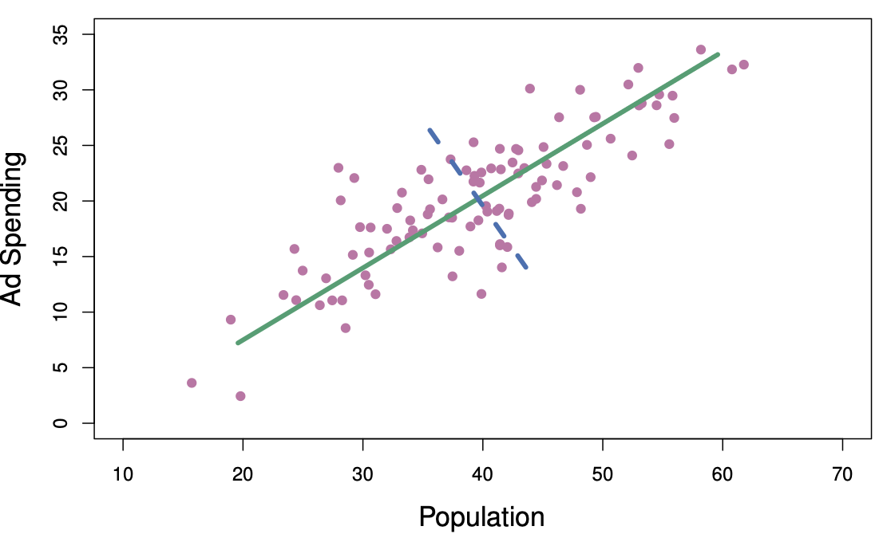

```{r}
#| warning: false
#| echo: false
#| include: false
#| message: false
#| purl: false
```


This unit will cover the following [topics]{.orange}:

-   Principal Components Analysis
-   Matrix Completion

# Unsupervised Learning

- Most of this course focuses on [supervised learning]{.orange} methods such as regression
- In supervised learning:
  - We observe features $X_1, X_2, \ldots, X_p$ and a response variable $Y$  
  - Goal: predict  $Y$ using $X_1, X_2, \ldots, X_p$  
- In [unsupervised learning]{.orange}:
  - We observe only features $X_1, X_2, \ldots, X_p$  
  - No response variable  $Y$ is available  
  - Goal is not prediction, but discovering structure in the data  


# Principal Components Analysis

- PCA produces a low-dimensional representation of a dataset  
- It finds a sequence of linear combinations of the variables that have maximal variance and are mutually uncorrelated  

- Apart from producing derived variables for use in supervised learning problems, PCA also serves as a tool for data visualization  


## Principal Components Analysis: details

- The [first principal component]{.orange} of a set of features $X_1, X_2, ..., X_p$ is the normalized linear combination of the features  
  $$
  Z_1 = \phi_{11}X_1 + \phi_{21}X_2 + \cdots + \phi_{p1}X_p
  $$
  that has the largest variance. By [normalized]{.orange}, we mean that:
  $$
  \sum_{j=1}^{p} \phi_{j1}^2 = 1
  $$

- We refer to the elements $\phi_{11}, ..., \phi_{p1}$ as the [loadings]{.blue} of the first principal component. Together, the loadings make up the principal component loading vector:
  $$
  \phi_1 = (\phi_{11} \ \phi_{21} \ \cdots \ \phi_{p1})^T
  $$

- We constrain the loadings so that their sum of squares is equal to one. Otherwise, arbitrarily large values would lead to arbitrarily large variance 

## Figure 6.14 ISL

{width="100%"}

The population size (`pop`) and ad spending (`ad`) for 100 different
cities are shown as purple circles. The green solid line indicates
the first principal component direction, and the blue dashed
line indicates the second principal component direction.


## Computation of Principal Components

- Suppose we have an $n \times p$ data set $\mathbf{X}$. Since we are only interested in variance, we assume that each of the variables in $\mathbf{X}$ has been centered to have mean zero (that is, the column means of $\mathbf{X}$ are zero)  

- We then look for the linear combination of the sample feature values of the form  
  $$
  z_{i1} = \phi_{11}x_{i1} + \phi_{21}x_{i2} + \cdots + \phi_{p1}x_{ip}
  $$
  for $i = 1, ..., n$ that has largest sample variance, subject to the constraint that $\sum_{j=1}^{p} \phi_{j1}^2 = 1$

- Since each of the $x_{ij}$ has mean zero, then so does $z_{i1}$ (for any values of $\phi_{j1}$). Hence the sample variance of the $z_{i1}$ can be written as  
  $$
  \frac{1}{n} \sum_{i=1}^{n} z_{i1}^2
  $$


## Computation: continued

- The first principal component loading vector solves the optimization problem:
  
  $$
  \max_{\phi_{11}, ..., \phi_{p1}}\sum_{i=1}^{n} \left( \sum_{j=1}^{p} \phi_{j1} x_{ij} \right)^2\quad \mathrm{subject\,\,to\,\,}\sum_{j=1}^{p} \phi_{j1}^2 = 1.
  $$

- This problem can be solved via [singular value decomposition]{.blue} (SVD) of the matrix $\mathbf{X}$, a standard technique in
linear algebra. 

- We refer to $Z_1$ as the first principal component, with realized values $z_{11}, ..., z_{n1}$  

## Required readings from the textbook and course materials


- **Chapter 12: Unsupervised Learning**

  - 12.1 The Challenge of Unsupervised Learning
  
  - 12.2 Principal Components Analysis
      - 12.2.1 What Are Principal Components?
      - 12.2.2 Another Interpretation of Principal Components
      - 12.2.3 The Proportion of Variance Explained
      - 12.2.4 More on PCA
         - Scaling the Variables
         - Uniqueness of the Principal Components
         - Deciding How Many Principal Components to Use
      - 12.2.5 Other Uses for Principal Components
      
      
  - 12.3 Missing Values and Matrix Completion
    - Principal Components with Missing Values
    - Recommender Systems


## Required readings from the textbook and course materials

[Video SL 12.1 Principal Components - 12:37  ](https://www.youtube.com/playlist?list=PLoROMvodv4rOzrYsAxzQyHb8n_RWNuS1e)

[Video SL 12.2 Higher Order Principal Components - 17:40](https://www.youtube.com/playlist?list=PLoROMvodv4rOzrYsAxzQyHb8n_RWNuS1e)

[Video SL 12.5 Matrix Completion - 15:52 ](https://www.youtube.com/playlist?list=PLoROMvodv4rOzrYsAxzQyHb8n_RWNuS1e)

[Video SL 12.R.1 Principal Components - 6:29 ](https://www.youtube.com/playlist?list=PLoROMvodv4rOzrYsAxzQyHb8n_RWNuS1e)


