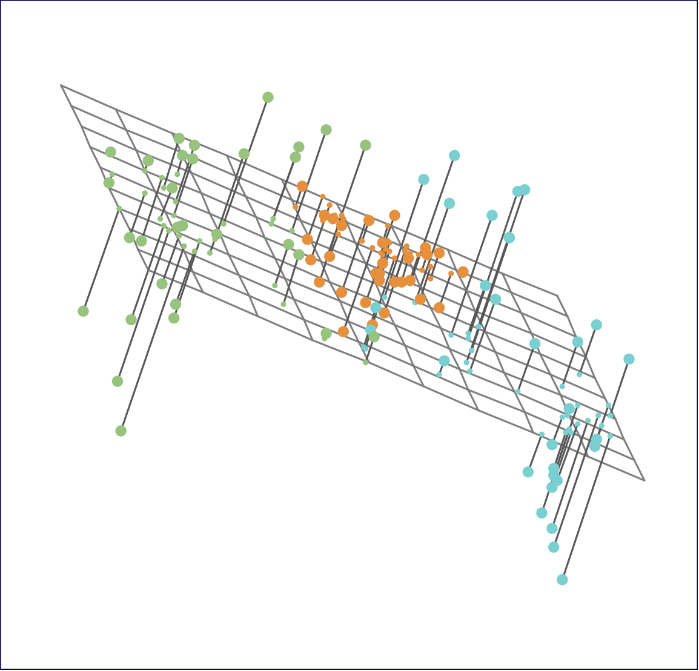
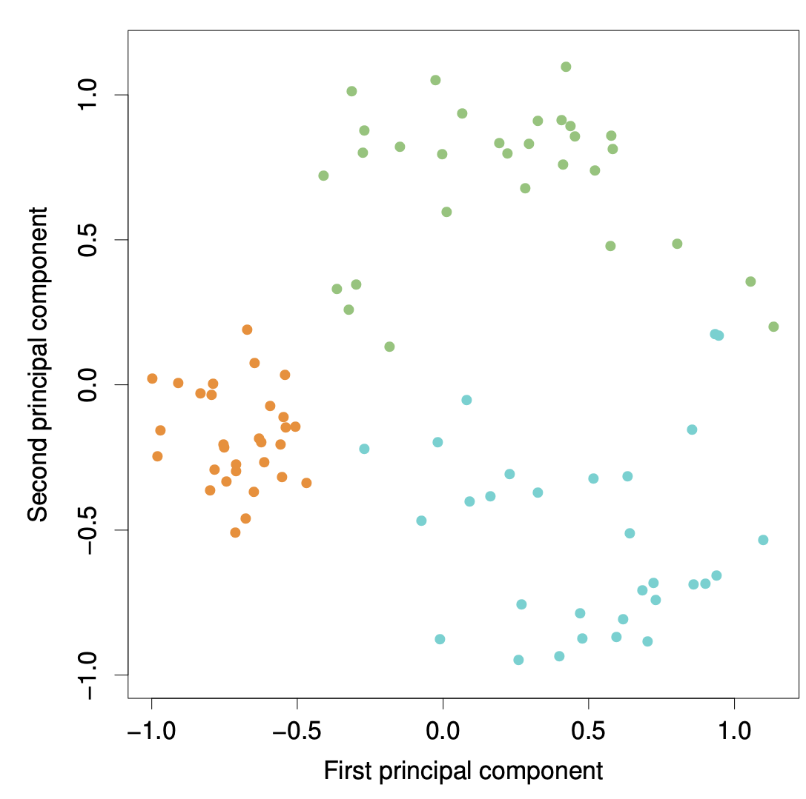
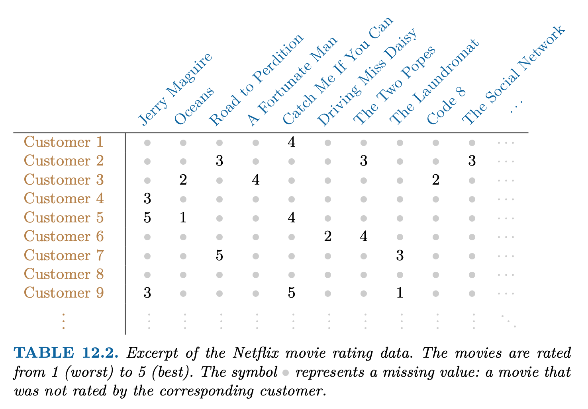

```{r}
#| warning: false
#| echo: false
#| include: false
#| message: false
#| purl: false
```


This unit will cover the following [topics]{.orange}:

-   Principal Components Analysis
-   Matrix Completion

## Unsupervised Learning

- Most of this course focuses on [supervised learning]{.orange} methods such as regression
- In supervised learning:
  - We observe features $X_1, X_2, \ldots, X_p$ and a response variable $Y$  
  - Goal: predict  $Y$ using $X_1, X_2, \ldots, X_p$  
- In [unsupervised learning]{.orange}:
  - We observe only features $X_1, X_2, \ldots, X_p$  
  - No response variable  $Y$ is available  
  - Goal is not prediction, but discovering structure in the data  


## Principal Components Analysis

- PCA produces a low-dimensional representation of a dataset  

- It finds a sequence of linear combinations of the variables that have maximal variance and are mutually uncorrelated  

- Apart from producing derived variables for use in supervised learning problems, PCA also serves as a tool for data visualization 


## Galton data

```{r}
#| warning: false
#| message: false
#| fig-width: 6
#| fig-height: 5
library(readr)
library(dplyr)

galton <- read_csv(
  "https://dspiegel29.github.io/ArtofStatistics/05-1-sons-fathers-heights/05-1-galton-x.csv"
)

# Convert to numeric and cm
galton <- galton %>%
  mutate(
    Father = as.numeric(Father) * 2.54,
    Height = as.numeric(Height) * 2.54
  )

# Keep only the first son for each father
galton_first_sons <- galton %>%
  filter(Gender == "M") %>%     # keep only sons
  group_by(Family) %>%          # group by family
  slice(1) %>%                  # take first son in each family
  ungroup()

# Build X
X <- as.matrix(galton_first_sons[, c("Father", "Height")])
head(X)
apply(X,2,mean)
```

The data matrix contains paired observations of father and son heights (in centimeters), where each row corresponds to a single family (using only the first son per father), and the two columns correspond to: `Father` the father’s height, and `Height`, the son’s height.

Thus, $\mathbf{X}$ is an $n \times 2$, where $n=173$ is the number of distinct fathers in the dataset.

The goal of the analysis is to summarize the relationship between fathers’ and sons’ heights using a single underlying dimension (tallness) that captures their shared variation.

##

```{r}
#| warning: false
#| message: false
#| fig-width: 6
#| fig-height: 5
plot(X, asp = 1,
     col = "purple", pch = 16,
     xlab = "Father height (cm)",
     ylab = "Son height (cm)")
mu <- colMeans(X)
points(mu[1], mu[2], col = "blue", pch = 19)
```

## Principal Components Analysis: details

- The [first principal component]{.orange} of a set of features $X_1, X_2, ..., X_p$ is the normalized linear combination of the features  
  $$
  Z_1 = \phi_{11}X_1 + \phi_{21}X_2 + \cdots + \phi_{p1}X_p
  $$
  that has the largest variance. By [normalized]{.orange}, we mean that:
  $$
  \sum_{j=1}^{p} \phi_{j1}^2 = 1
  $$

- We refer to the elements $\phi_{11}, ..., \phi_{p1}$ as the [loadings]{.blue} of the first principal component. Together, the loadings make up the principal component loading vector:
  $$
  \phi_1 = (\phi_{11} \ \phi_{21} \ \cdots \ \phi_{p1})^T
  $$

- We constrain the loadings so that their sum of squares is equal to one. Otherwise, arbitrarily large values would lead to arbitrarily large variance 

## 

```{r}
#| warning: false
#| message: false
#| fig-width: 6
#| fig-height: 5
# Center
mu <- colMeans(X)
Xc <- scale(X, center = TRUE, scale = FALSE)

# PCA
pca <- prcomp(Xc)

v1 <- pca$rotation[, 1]
v2 <- pca$rotation[, 2]

plot(X, asp = 1,
     col = "purple", pch = 16,
     xlab = "Father height (cm)",
     ylab = "Son height (cm)")

points(mu[1], mu[2], col = "black", pch = 19)

t_vals <- seq(-max(abs(Xc)) * 2, max(abs(Xc)) * 2, length = 100)

lines(mu[1] + t_vals * v1[1],
      mu[2] + t_vals * v1[2],
      col = "green", lwd = 2)

lines(mu[1] + t_vals * v2[1],
      mu[2] + t_vals * v2[2],
      col = "blue", lwd = 2, lty = 2)
```

The father and son heights, measured in centimeters, are shown as purple circles. The green solid line indicates the first principal component direction, and the blue dashed line indicates the second principal component direction.

##

```{r}
#| warning: false
#| message: false
#| fig-width: 6
#| fig-height: 5
mu <- colMeans(X)
Xc <- scale(X, center = TRUE, scale = FALSE)

pca <- prcomp(Xc)
v1 <- pca$rotation[, 1]

scores1 <- Xc %*% v1

proj <- scores1 %*% t(v1)
proj_orig <- sweep(proj, 2, mu, "+")

par(mfrow = c(1, 2))

plot(X, asp = 1, pch = 16, col = "purple",
     xlab = "Father height (cm)",
     ylab = "Son height (cm)")
points(mu[1], mu[2], col = "blue", pch = 19)

t_vals <- seq(-max(abs(Xc)) * 2, max(abs(Xc)) * 2, length = 100)
pc1_line <- cbind(mu[1] + t_vals * v1[1],
                  mu[2] + t_vals * v1[2])

lines(pc1_line, col = "green", lwd = 2)

for (i in 1:nrow(X)) {
  segments(X[i, 1], X[i, 2],
           proj_orig[i, 1], proj_orig[i, 2],
           col = "black", lty = 2)
}

Z <- Xc %*% pca$rotation

plot(Z, asp = 1, pch = 16, col = "purple",
     xlab = "PC1", ylab = "PC2")
points(0, 0, col = "blue", pch = 19)

abline(h = 0, v = 0, col = "gray")
```

The Galton data are shown, where fathers’ heights and sons’ heights are plotted as purple points. The mean father height and mean son height are indicated by a blue circle.

Left: The first principal component direction is shown in green. It is the direction along which the data exhibit the greatest variability. The perpendicular distances from each observation to this line are illustrated by black dashed segments. The blue dot represents $(\overline{\mathrm{Father}}, \overline{\mathrm{Height}})$.

Right: The data from the left panel have been rotated so that the first principal component direction aligns with the x-axis.

##

Mathematically, the first principal component can be written as a linear combination of the centered variables:

$$
Z_1 = 0.700\,(\mathrm{Father} - \overline{\mathrm{Father}}) + 0.714\,(\mathrm{Height} - \overline{\mathrm{Height}})
$$

Here, the coefficients $\phi_{11}=0.7$ and $\phi_{21}=0.714$ (called [loadings]{.orange}) define the principal component direction. They satisfy $0.7^2 + 0.714^2 =1$.

Since both loadings are positive and of similar magnitude, $Z_1$ is essentially an average of father’s and son’s heights, capturing a common overall height dimension. For each family $i$,
$$
z_{i1} = 0.700\,(\mathrm{Father}_i - \overline{\mathrm{Father}}) + 0.714\,(\mathrm{Height}_i - \overline{\mathrm{Height}})
$$

The values of $z_{11},z_{21},\ldots,z_{n1}$ are known as the first principal component [scores]{.orange}.

##

```{r}
#| warning: false
#| message: false
#| fig-width: 6
#| fig-height: 5
Xc <- scale(X, center = TRUE, scale = FALSE)

pca <- prcomp(Xc)
z1 <- -pca$x[, 1]

par(mfrow = c(1, 2), mar = c(5, 5, 4, 2))

# Father vs z1 (z1 on x-axis)
plot(z1, X[, "Father"], asp = 1,
     pch = 16, col = "purple",
     xlab = expression(z[i1]),
     ylab = "Father height (cm)",
     main = "Father vs PC1 scores")
#abline(lm(X[, "Father"] ~ z1), col = "blue", lwd = 2)

# Son height vs z1 (z1 on x-axis)
plot(z1, X[, "Height"], asp = 1,
     pch = 16, col = "purple",
     xlab = expression(z[i1]),
     ylab = "Son height (cm)",
     main = "Son height vs PC1 scores")
#abline(lm(X[, "Height"] ~ z1), col = "blue", lwd = 2)
```

Plots of the first principal component scores $z_{i1}$
 versus father height and son height. The relationships are strong.
 
##

```{r}
#| warning: false
#| message: false
#| fig-width: 6
#| fig-height: 5

Xc <- scale(X, center = TRUE, scale = FALSE)

pca <- prcomp(Xc)
z2 <- -pca$x[, 2]

par(mfrow = c(1, 2), mar = c(5, 5, 4, 2))

# Father vs z2
plot(z2, X[, "Father"], asp = 1,
     pch = 16, col = "purple",
     xlab = expression(z[i2]),
     ylab = "Father height (cm)",
     main = "Father vs PC2 scores")
#abline(lm(X[, "Father"] ~ z2), col = "blue", lwd = 2)

# Son height vs z2
plot(z2, X[, "Height"], asp = 1,
     pch = 16, col = "purple",
     xlab = expression(z[i2]),
     ylab = "Son height (cm)",
     main = "Son height vs PC2 scores")
#abline(lm(X[, "Height"] ~ z2), col = "blue", lwd = 2)
```

Plots of the second principal component scores $z_{i2}$
 versus father height and son height. The relationships are weak.


## Computation of Principal Components

- Suppose we have an $n \times p$ data set $\mathbf{X}$. Since we are only interested in variance, we assume that each of the variables in $\mathbf{X}$ has been centered to have mean zero (that is, the column means of $\mathbf{X}$ are zero)  

- We then look for the linear combination of the sample feature values of the form  
  $$
  z_{i1} = \phi_{11}x_{i1} + \phi_{21}x_{i2} + \cdots + \phi_{p1}x_{ip}
  $$
  for $i = 1, ..., n$ that has largest sample variance, subject to the constraint that $\sum_{j=1}^{p} \phi_{j1}^2 = 1$

- Since each of the $x_{ij}$ has mean zero, then so does $z_{i1}$ (for any values of $\phi_{j1}$). Hence the sample variance of the $z_{i1}$ can be written as  
  $$
  \frac{1}{n} \sum_{i=1}^{n} z_{i1}^2
  $$


## Computation: continued

- The first principal component loading vector solves the optimization problem:
  
  $$
  \max_{\phi_{11}, ..., \phi_{p1}}\sum_{i=1}^{n} \left( \sum_{j=1}^{p} \phi_{j1} x_{ij} \right)^2\quad \mathrm{subject\,\,to\,\,}\sum_{j=1}^{p} \phi_{j1}^2 = 1.
  $$

- This problem can be solved via [singular value decomposition]{.blue} (SVD) of the matrix $\mathbf{X}$, a standard technique in
linear algebra. 

- We refer to $Z_1$ as the first principal component, with realized values $z_{11}, \ldots, z_{n1}$  


## Geometry of PCA

* The loading vector $\phi_1$ with elements $\phi_{11},\phi_{21}, \ldots, \phi_{p1}$ defines a direction in feature space along which the data vary the most.

* If we project the $n$ data points $x_1,\ldots,x_n$ onto this
direction, the projected values are the principal component
scores $z_{11},z_{21},\ldots,z_{n1}$ themselves.

## Further principal components

* The second principal component is the linear combination
of $X_1,...,X_p$ that has maximal variance among all linear
combinations that are uncorrelated with $Z_1$.

* The second principal component scores
$z_{12},z_{22},\ldots,z_{n2}$ take the form
  $$
  z_{i2} = \phi_{12}x_{i1} + \phi_{22}x_{i2} + \cdots + \phi_{p2}x_{ip}
  $$
where $\phi_2$ is the second principal component loading vector,
with elements, with elements $\phi_{12},\phi_{22}, \ldots, \phi_{p2}$.

## Further principal components: continued

* The principal component directions $\phi_1, \phi_2, \phi_3, \ldots$ are the
ordered sequence of [right singular vectors]{.blue} of the matrix $\textbf X$,
and the variances of the components are $1/n$ times the
squares of the [singular values]{.blue}. There are at most
$\min(n−1,p)$ principal components.

* Let 
$$\mathbf{Z} = ( \mathbf{z}_1 \,\, \mathbf{z}_2 \,\, \ldots \,\, \mathbf{z}_p )$$ 
denote the matrix of principal component scores, and let 
$$\mathbf{\Phi} = ( \phi_1 \,\, \phi_2 \,\, \ldots \,\, \phi_p )$$ 
denote the matrix of loading vectors

## Another Interpretation of Principal Components

* The first principal component loading vector has a very
special property: it defines the line in $p$-dimensional space
that is closest to the $n$ observations (using average squared
Euclidean distance as a measure of closeness)

* The notion of principal components as the dimensions that
are closest to the $n$ observations extends beyond just the
first principal component.

* For instance, the first two principal components of a data
set span the plane that is closest to the $n$ observations, in
terms of average squared Euclidean distance.

## ISL Figure 12.2

{width="40%"}
{width="40%"}


Ninety observations simulated in three dimensions. The observations are displayed in color for ease of visualization. 

Left: the first two principal
component directions span the plane that best fits the data. The plane is positioned
to minimize the sum of squared distances to each point. 

Right: the first two principal component score vectors give the coordinates of the projection of the 90
observations onto the plane.

## Proportion Variance Explained

* To understand the strength of each principal component, we consider the **proportion of variance explained (PVE)** by each component.

* The total variance in the data (assuming the variables are centered) is
$$
\sum_{j=1}^{p} \mathrm{Var}(X_j)
=
\sum_{j=1}^{p} \frac{1}{n} \sum_{i=1}^{n} x_{ij}^2.
$$

* The variance explained by the $m$-th principal component is
$$
\mathrm{Var}(Z_m)
=
\frac{1}{n} \sum_{i=1}^{n} z_{im}^2.
$$

It can be shown that the total variance is preserved under PCA:
$$
\sum_{j=1}^{p} \mathrm{Var}(X_j)
=
\sum_{m=1}^{M} \mathrm{Var}(Z_m),
\quad \text{where } M = \min(n-1, p).
$$

* The proportion of variance explained (PVE) by the $m$-th principal component is given by the ratio
$$
\mathrm{PVE}_m
=
\frac{\sum_{i=1}^{n} z_{im}^2}
{\sum_{j=1}^{p} \sum_{i=1}^{n} x_{ij}^2},
$$
which is a value between 0 and 1.

* The PVEs sum to one. We sometimes display the
cumulative PVEs

## Singular Value Decomposition

The Singular Value Decomposition expresses any matrix, such as an $n \times p$ matrix $\mathbf{X}$, as the product of three other matrices:

$$
\mathbf{X = U D V^\mathsf{T}}
$$

where:

- $\mathbf{U}$ is a $n \times p$ column _orthonormal_ matrix containing the 
__left singular vectors__.

- $\mathbf{D}$ is a $p \times p$ _diagonal_ matrix containing the __singular 
values__ of $\mathbf{X}$.

- $\mathbf{V}$ is a $p \times p$ column _orthonormal_ matrix containing the 
__right singular vectors__.

In terms of the shapes of the matrices, the SVD decomposition has this form:

$$
\begin{bmatrix} 
 &   & \\
 &   & \\
 & \mathbf{X} & \\
 &   & \\
 &   & \\
\end{bmatrix}
= 
\
\begin{bmatrix} 
 &   & \\
 &   & \\
 & \mathbf{U} & \\
 &   & \\
 &   & \\
\end{bmatrix}
\
\begin{bmatrix} 
 &   & \\
 & \mathbf{D} & \\
 &   & \\
\end{bmatrix}
\
\begin{bmatrix} 
 &   & \\
 & \mathbf{V}^\mathsf{T} & \\
 &   & \\
\end{bmatrix}
$$


##

{width="40%"}

##

If we assume that each of
the variables in $\mathbf{X}$ has been centered to have mean zero (that is, the column means of $\mathbf{X}$ are zero), then 
$$
\mathbf{X} = \mathbf{Z} \mathbf{\Phi}^\mathsf{T}
$$
where $\mathbf{Z} = \mathbf{UD}$ and $\mathbf{\Phi}=\mathbf{V}$.


## SVD Rank-Reduction Theorem

* The Eckart–Young theorem (1936) addresses the problem of approximating a matrix by one of lower rank.

* Let $\mathbf{X}$ be an 
$n \times p$ rectangular matrix (centered). The best $M$-dimensional approximation 
$\hat{\mathbf{X}}$ to $\mathbf{X}$ in the least-squares sense, is obtained by solving:
$$\min_{\mathrm{rank} (\hat{\mathbf{X}})=M }\Big\{ \sum_{i=1}^{n}\sum_{j=1}^{p}(x_{ij} - \hat x_{ij} )^2 \Big\}$$

* The solution is
$$\hat{x}_{ij} = \sum_{m=1}^{M} z_{im} \phi_{jm}$$
or, in matrix form,
$$
\hat{\mathbf{X}} = \mathbf{U}_M \mathbf{D}_M \mathbf{V}^\mathsf{T}_M = \mathbf{Z}_M \mathbf{\Phi}_M^\mathsf{T}
$$


##

{width="40%"}

## Best 1-rank approximation

If you think about it, the SVD is of great utility because it tells us that the 
best 1-rank approximation, in the least squares sense, of any matrix 
$\mathbf{X}$ is 
$$
\hat{x}_{ij} = z_{i1} \phi_{j1}
$$

This implies that, from a conceptual standpoint, we can approximate the 
$n \times p$ numbers in $\mathbf{X}$ with just $n + p$ values: $n$ numbers 
in $\mathbf{z}_1$ and $p$ numbers in $\phi_1$.

## Example


```{r}
#| warning: false
#| message: false
#| fig-width: 6
#| fig-height: 5
rm(list=ls())
face <- read.table("https://raw.githubusercontent.com/aldosolari/AE/master/docs/dati/face.txt", header=FALSE)
X = as.matrix(face)
n = nrow(face)
p = ncol(face)
image(t(X)[, ncol(X):1], col = gray(0:255/255), asp = p/n)
```

## Example: best M-rank approximation

Obtain the best rank-$M$ approximation of the column centered matrix $\mathbf{X}^c$
$$\hat{\mathbf{X}}_M = \mathbf{Z}_M \mathbf{\Phi}_M$$
then construct the compressed image
$$\hat{\mathbf{X}}_M + \mathbf{1}_n \bar{x}$$
ensuring that all elements lie in the interval $[0,1]$, where $\mathbf{1}_n$ is an $n\times 1$ vector of ones, and $\bar{x}$ is the $1\times p$ vector of the column means of the original (not column centered) matrix $\mathbf{X}$.

##

```{r}
#| warning: false
#| message: false
#| fig-width: 6
#| fig-height: 5
# PCA
pca = princomp(X, cor=F)
V = pca$loadings
Y = pca$scores
xbar = matrix(pca$center, ncol=1)
q = 5
Yq = Y[,1:q]
Vq = V[,1:q]

# migliore approssimazione di rango q
Aq = Yq %*% t(Vq)

# compressione immagine
one.n = matrix(rep(1,n), ncol=1)

qs <- c(2, 5, 10, 20)

par(mfrow = c(2, 2), mar = c(2, 2, 3, 1))

for (q in qs) {
  
  Yq <- Y[, 1:q]
  Vq <- V[, 1:q]
  
  # Best rank-q approximation
  Aq <- Yq %*% t(Vq)
  
  # Reconstructed image
  face2 <- Aq + one.n %*% t(xbar)
  
  # Force values between 0 and 1
  face2 <- pmax(pmin(face2, 1), 0)
  
  image(t(face2)[, ncol(face2):1],
        col = gray(0:255 / 255),
        asp = p / n,
        axes = FALSE,
        main = paste("M =", q))
}

```


## Matrix Completion and Missing Values

* It is often the case that data matrices $\mathbf{X}$ have missing
entries, often represented by `NA`s (not available).

* This is a nuisance, since many of our modeling procedures,
such as linear regression and GLMs require complete data.

* Sometimes imputation [is the prediction problem]{.blue}! — as in recommender systems.

* One simple approach is [mean imputation]{.orange} — replace missing values for a variable by the mean of the non-missing entries.

* This ignores the correlations among variables; we should be
able to exploit these correlations when imputing missing
values.

* We assume values are missing [at random]{.blue}; i.e. the
missingness should not be informative.

* We present an approach based on principal components.

## Recommender Systems 

{fig-align="center"}

* Netflix users rate movies they have seen, usually a very
from 1 (worst) to 5 (best). The symbol • represents a missing value: a movie that was not rated by the corresponding customer small fraction of available movies.

* Predicting missing ratings provides a way to recommend
movies to users. Matrix completion is one of the primary
tools.


## Matrix Approximation via Principal Components

* Previously we gave an interpretation of principal
components in terms of matrix approximation:

$$\min_{\mathbf{A} \in \mathbb{R}^{n\times M},\, \mathbf{B} \in \mathbb{R}^{p \times M} }\Big\{ \sum_{i=1}^{n}\sum_{j=1}^{p}(x_{ij} - \sum_{m=1}^{M} a_{im}b_{jm} )^2 \Big\}$$
$\mathbf{A}$ is a $n\times M$ matrix whose $(i,m)$ element is $a_{im}$, and $\mathbf{B}$ is a
$p \times M$ element whose $(j,m)$ element is $b_{jm}$.

* It can be shown that for any value of $M$, the first $M$
[principal components]{.orange} provide a solution: 
$$\hat{a}_{jm} = z_{im},\quad \hat{b}_{jm} = \phi_{jm}.$$

* But what to do if the matrix has missing elements?

## Matrix Completion via Principal Components

* We pose instead a modified version of the approximation
criterion:

$$\min_{\mathbf{A} \in \mathbb{R}^{n\times M},\, \mathbf{B} \in \mathbb{R}^{p \times M} }\Big\{ \sum_{(i,j) \in \mathcal{O}} (x_{ij} - \sum_{m=1}^{M} a_{im}b_{jm} )^2 \Big\}$$
where $\mathcal{O}$ is the set of all [observed]{.blue} pairs of indices $(i,j)$, a subset
of the possible $n \times p$ pairs.

* Once we solve this problem: 

   * we can estimate a missing observation $x_{ij}$ using:
$$\hat{x}_{ij} = \sum_{m=1}^{M} \hat{a}_{im} \hat{b}_{jm},$$
where $\hat{a}_{im}$ and
$\hat{b}_{jm}$ are the $(i,m)$ and
$(j,m)$ elements of the solution matrices
$\hat{\mathbf{A}}$ and $\hat{\mathbf{B}}$. 

  * we can (approximately) recover the $M$ principal component
scores and loadings, as if data were complete.


## Iterative Algorithm for Matrix Completion

1. [Initialize]{.orange}: create a complete data matrix $\tilde{\mathbf{X}}$ by filling in the
missing values using mean imputation. 

2. [repeat]{.orange}: steps (a)–(c) until the objective in (c) fails to decrease:

   (a). $$\min_{\mathbf{A} \in \mathbb{R}^{n\times M},\, \mathbf{B} \in \mathbb{R}^{p \times M} }\Big\{ \sum_{i=1}^{n}\sum_{j=1}^{p}( \tilde{x}_{ij} - \sum_{m=1}^{M} a_{im}b_{jm} )^2 \Big\}$$
   by computing the principal components of $\tilde{\mathbf{X}}$

   (b). For each missing entry $(i,j) \notin \mathcal{O}$, set
   $$\tilde{x}_{ij} \leftarrow \sum_{m=1}^{M} \hat{a}_{im} \hat{b}_{jm}$$
  (c). Compute the objective
  $$\sum_{(i,j) \in \mathcal{O}}( x_{ij} - \sum_{m=1}^{M} \hat{a}_{im}\hat{b}_{jm} )^2$$
3. Return the estimated missing entries 
$$\tilde{x}_{ij}, \quad (i,j) \notin \mathcal{O}$$
  
## MovieLens data

* [Source]{.blue}: MovieLens, provided by GroupLens Research Group, University of Minnesota

* [Citation]{.blue} Harper, F. M., & Konstan, J. A. (2015). The MovieLens Datasets: History and Context. ACM Transactions on Interactive Intelligent Systems (TiiS), 5(4).

* [Full dataset (2024)]{.blue}: ~32M ratings, 87K movies, 200K users. 

* [Reduced dataset (2009)]{.blue}: ~10M ratings, 10K movies, 72K users. 

* [Link]{.blue}: [https://grouplens.org/datasets/movielens/10m/](https://grouplens.org/datasets/movielens/10m/)

* [Train / Test split]{.blue}: ~9M / ~1M (The test set includes only users and movies that are also present in the training set)

## 

```{r}
#| warning: false
#| message: false
#| fig-width: 6
#| fig-height: 5
rm(list=ls())
library(data.table)
library(stringr)
movielens <- readRDS("/Users/aldo/Desktop/movielens_10m.rds")
movielens[, date := as.POSIXct(timestamp, origin = "1970-01-01")]
head(movielens)

set.seed(123)

test_index <- sample(seq_len(nrow(movielens)), 0.1 * nrow(movielens))

training_set <- movielens[-test_index, ]
temp <- movielens[test_index, ]

test_set <- temp[
  temp$movieId %in% training_set$movieId &
    temp$userId %in% training_set$userId,
]

removed <- temp[
  !(temp$movieId %in% test_set$movieId &
      temp$userId %in% test_set$userId),
]

training_set <- rbind(training_set, removed)

dim(training_set)
dim(test_set)
```

##  Basic summaries

```{r}
#| warning: false
#| message: false
#| fig-width: 6
#| fig-height: 5
#| echo: TRUE
# Ratings distribution:
table(training_set$rating)
# Ratings mean:
mean(training_set$rating)
# Ratings per movie:
summary(as.numeric(table(training_set$movieId)))
# Ratings per user:
summary(as.numeric(table(training_set$userId)))
```

##  Rating distribution

```{r}
#| warning: false
#| message: false
#| fig-width: 6
#| fig-height: 5
rating_count <- table(training_set$rating)

barplot(
  rating_count,
  col = "#8888ff",
  xlab = "Rating",
  ylab = "Count"
)
```

##  Ratings per year

```{r}
#| warning: false
#| message: false
#| fig-width: 6
#| fig-height: 5
# Extract year
year_vec <- as.numeric(format(
  as.POSIXct(training_set$timestamp, origin = "1970-01-01"),
  "%Y"
))

# Count ratings per year
year_count <- table(year_vec)

# Plot
barplot(
  year_count,
  col = "#8888ff",
  xlab = "Year",
  ylab = "Number of Ratings",
  las = 2  # rotate labels for readability
)
```

## Average rating per year

```{r}
#| warning: false
#| message: false
#| fig-width: 6
#| fig-height: 5
# Average rating per year
training_set$year <- as.numeric(format(
  as.POSIXct(training_set$timestamp, origin = "1970-01-01"),
  "%Y"
))

avg_year <- aggregate(rating ~ year, data = training_set, mean)

plot(
  avg_year$year,
  avg_year$rating,
  type = "b",
  pch = 19,
  col = "#4020dd",
  xlab = "Year",
  ylab = "Average Rating",
  ylim = c(3, 5)
)
```

## Ratings per movie

```{r}
#| warning: false
#| message: false
#| fig-width: 6
#| fig-height: 5
# Ratings per movie
movie_counts <- data.frame(table(training_set$movieId))
colnames(movie_counts) <- c("movieId", "count")
movie_counts$movieId <- as.numeric(as.character(movie_counts$movieId))

plot(
  movie_counts$movieId,
  movie_counts$count,
  pch = 19,
  col = rgb(0.25, 0.12, 0.87, 0.2),
  xlab = "Movie ID",
  ylab = "Number of Ratings"
)
```

## Movies' rating histogram

```{r}
#| warning: false
#| message: false
#| fig-width: 6
#| fig-height: 5
# -------------------------
# Movies' rating histogram (base R, log scale)
# -------------------------

# Count ratings per movie
movie_counts <- table(training_set$movieId)

# Log-transform (equivalent to scale_x_log10)
log_counts <- log10(movie_counts)

hist(
  log_counts,
  breaks = 30,
  col = "#8888ff",
  border = "#4020dd",
  main = "",
  xlab = "Number of Ratings (log scale)",
  ylab = "Number of Movies",
  xaxt = "n"
)

# Add axis with original scale labels
axis(
  1,
  at = pretty(log_counts),
  labels = round(10^pretty(log_counts))
)
```

## Ratings per user

```{r}
#| warning: false
#| message: false
#| fig-width: 6
#| fig-height: 5
# Ratings per user
user_counts <- data.frame(table(training_set$userId))
colnames(user_counts) <- c("userId", "count")
user_counts$userId <- as.numeric(as.character(user_counts$userId))

plot(
  user_counts$userId,
  user_counts$count,
  pch = 19,
  col = rgb(0.25, 0.12, 0.87, 0.2),
  xlab = "User ID",
  ylab = "Number of Ratings"
)
```

## Users' rating histogram

```{r}
#| warning: false
#| message: false
#| fig-width: 6
#| fig-height: 5
# -------------------------
# Users' rating histogram (base R, log scale)
# -------------------------

# Count ratings per user
user_counts <- table(training_set$userId)

# Log-transform (equivalent to scale_x_log10)
log_counts <- log10(user_counts)

hist(
  log_counts,
  breaks = 30,
  col = "#8888ff",
  border = "#4020dd",
  main = "",
  xlab = "Number of Ratings (log scale)",
  ylab = "Number of Users",
  xaxt = "n"
)

# Add axis with original (non-log) labels
axis(
  1,
  at = pretty(log_counts),
  labels = round(10^pretty(log_counts))
)
```


## Genre Popularity

```{r}
#| warning: false
#| message: false
#| fig-width: 6
#| fig-height: 5
# -------------------------
# Genre counts + plot (base R)
# -------------------------

genres <- c("Action", "Adventure", "Animation", 
            "Children", "Comedy", "Crime", 
            "Documentary", "Drama", "Fantasy", 
            "Film-Noir", "Horror", "Musical", 
            "Mystery", "Romance", "Sci-Fi", 
            "Thriller", "War", "Western")

# Count occurrences (fixed = TRUE is faster than regex)
genre_counts <- sapply(genres, function(g) {
  sum(grepl(g, training_set$genres, fixed = TRUE))
})

genres_df <- data.frame(
  Genres = genres,
  Count = genre_counts,
  stringsAsFactors = FALSE
)

print(genres_df)

# Sort for nicer plot
ord <- order(genres_df$Count)
genres_df <- genres_df[ord, ]

# Plot (horizontal barplot)
barplot(
  genres_df$Count,
  names.arg = genres_df$Genres,
  horiz = TRUE,
  col = "#8888ff",
  border = "#4020dd",
  main = "",
  xlab = "Number of Ratings",
  las = 1,          # horizontal labels
  cex.names = 0.8
)
```


## Genre Average Rating

```{r}
#| warning: false
#| message: false
#| fig-width: 6
#| fig-height: 5
genres_df_2 <- data.frame(
  Genres = genres,
  Rating = sapply(genres, function(g) {
    idx <- grepl(g, training_set$genres, fixed = TRUE)
    mean(training_set$rating[idx], na.rm = TRUE)
  }),
  stringsAsFactors = FALSE
)

# Sort for readability
ord <- order(genres_df_2$Rating)
genres_df_2 <- genres_df_2[ord, ]

dotchart(
  genres_df_2$Rating,
  labels = genres_df_2$Genres,
  xlim = c(0, 5),
  pch = 19,
  col = "#4020dd",
  main = "",
  xlab = "Average Rating"
)

# Optional: light reference grid
abline(v = seq(0, 5, by = 0.5), col = "grey90", lty = "dotted")
```


## User x Movie matrix sample

```{r}
#| warning: false
#| message: false
#| fig-width: 6
#| fig-height: 5
# Ratings per user
set.seed(1)

limit <- 60
sample_users <- sample(unique(training_set$userId), limit)

small <- training_set[training_set$userId %in% sample_users, ]

user_movie_matrix <- as.matrix(table(small$userId, small$movieId))

sample_movies <- sample(seq_len(ncol(user_movie_matrix)), limit)
user_movie_matrix <- user_movie_matrix[, sample_movies]

user_movie_matrix[user_movie_matrix > 0] <- 1

image(
  seq_len(ncol(user_movie_matrix)),
  seq_len(nrow(user_movie_matrix)),
  t(user_movie_matrix),
  xlab = "Movies",
  ylab = "Users",
  main = "User x Movie Matrix",
  col = c("white", "#4020dd")
)

abline(
  h = seq_len(nrow(user_movie_matrix)) + 0.5,
  v = seq_len(ncol(user_movie_matrix)) + 0.5,
  col = "grey"
)
```

## Global mean baseline model 

* Predicts every rating as the overall average rating in the training set
$$\hat{r}_{ui} = \mu$$
where $\hat{r}_{ui}$ is the model’s prediction of how user $u$ would rate movie $i$, and $\mu$ is the global mean of all ratings


```{r}
#| warning: false
#| message: false
#| fig-width: 6
#| fig-height: 5
#| echo: TRUE

mu <- mean(training_set$rating)
pred_global <- rep(mu, nrow(test_set))
RMSE <- function(true, pred) {
  sqrt(mean((true - pred)^2))
}
rmse_global <- RMSE(test_set$rating, pred_global)
rmse_global
```


## User bias model 

Predicts each rating as the overall average rating plus a user-specific bias:
$$
\hat{r}_{ui} = \mu + b_u
$$

where $b_u$ is the average deviation of user $u$ from the global mean, estimated as:
$$
b_u = \frac{1}{N_u} \sum_i (r_{ui} - \mu)
$$

with $N_u$ the number of ratings made by user $u$, and $\sum_i$ the sum over all movies rated by user $u$.

Substituting $b_u$ into the prediction shows that:
$$
\hat{r}_{ui} = \mu + (\bar{r}_u - \mu) = \bar{r}_u
$$

where $\bar{r}_u$ is the average rating given by user $u$.

Therefore, this model predicts the same value for all movies for a given user, equal to the user’s average rating.


```{r}
#| warning: false
#| message: false
#| fig-width: 6
#| fig-height: 5
#| eval: FALSE
#| echo: TRUE

# -------------------------
# User bias model via lm()
# -------------------------

# Fit linear model with user fixed effects
fit_user <- lm(rating ~ factor(userId), data = training_set)

# Predict on test set
pred_user_lm <- predict(fit_user, newdata = test_set)

# Handle unseen users (NA predictions)
pred_user_lm[is.na(pred_user_lm)] <- mu

# RMSE
rmse_user_lm <- RMSE(test_set$rating, pred_user_lm)

rmse_user_lm
```

```{r}
#| warning: false
#| message: false
#| fig-width: 6
#| fig-height: 5
user_sum <- tapply(training_set$rating - mu, training_set$userId, sum)
user_n <- table(training_set$userId)

b_u_only <- user_sum / user_n

pred_user <- mu + b_u_only[as.character(test_set$userId)]
pred_user[is.na(pred_user)] <- mu

rmse_user <- RMSE(test_set$rating, pred_user)

rmse_user
```

## Movie bias model 

Predicts each rating as the overall average rating plus a movie-specific bias:
$$
\hat{r}_{ui} = \mu + b_i
$$

where $b_i$ is the average deviation of movie $i$ from the global mean, estimated as:
$$
b_i = \frac{1}{N_i} \sum_u (r_{ui} - \mu)
$$

with $N_i$ the number of ratings received by movie $i$, and $\sum_u$ the sum over all users who rated movie $i$.

Therefore, this model predicts the same value for all users for a given movie, equal to the movie’s average rating.

```{r}
#| warning: false
#| message: false
#| fig-width: 6
#| fig-height: 5
movie_sum <- tapply(training_set$rating - mu, training_set$movieId, sum)
movie_n <- table(training_set$movieId)

b_i_only <- movie_sum / movie_n

pred_movie <- mu + b_i_only[as.character(test_set$movieId)]
pred_movie[is.na(pred_movie)] <- mu

rmse_movie <- RMSE(test_set$rating, pred_movie)

rmse_movie
```


## User + Movie bias model

This model improves the previous models by adding both a movie-specific bias and a user-specific bias:

$$
\hat{r}_{ui} = \mu + b_i + b_u
$$

* Step 1: Estimate movie bias

The movie bias measures how much movie $i$ tends to be rated above or below the global average:

$$
b_i = \frac{1}{N_i} \sum_u (r_{ui} - \mu)
$$


* Step 2: Estimate user bias after removing movie bias

The user bias measures how much user $u$ tends to rate above or below what is expected after accounting for the movie effect:
$$
b_u = \frac{1}{N_u} \sum_i (r_{ui} - \mu - b_i)
$$


* Step 3: Make predictions

The final prediction adds together the global mean, movie bias, and user bias:

$$
\hat{r}_{ui} = \mu + b_i + b_u
$$

Predictions are then limited to the valid rating range:

$$
0.5 \leq \hat{r}_{ui} \leq 5
$$

```{r}
#| warning: false
#| message: false
#| fig-width: 6
#| fig-height: 5
setDT(training_set)
setDT(test_set)

lambda <- 0

movie_bias <- training_set[
  , .(b_i = sum(rating - mu) / (.N + lambda)),
  by = movieId
]

training_set <- merge(
  training_set,
  movie_bias,
  by = "movieId",
  all.x = TRUE
)

training_set[is.na(b_i), b_i := 0]

user_bias <- training_set[
  , .(b_u = sum(rating - mu - b_i) / (.N + lambda)),
  by = userId
]

test_pred <- merge(
  test_set,
  movie_bias,
  by = "movieId",
  all.x = TRUE
)

test_pred <- merge(
  test_pred,
  user_bias,
  by = "userId",
  all.x = TRUE
)

test_pred[is.na(b_i), b_i := 0]
test_pred[is.na(b_u), b_u := 0]

pred_user_movie <- test_pred[, mu + b_i + b_u]
pred_user_movie <- pmin(pmax(pred_user_movie, 0.5), 5)

rmse_user_movie <- RMSE(test_pred$rating, pred_user_movie)

rmse_user_movie
```

## Matrix completion with SVD

This model extends the user + movie bias model by learning an additional latent interaction term using SVD.

The prediction is:
$$
\hat{r}_{ui} = \mu + b_i + b_u + s_{ui}
$$
where:

- $\mu$ is the global mean rating
- $b_i$ is the movie bias
- $b_u$ is the user bias
- $s_{ui}$ is the SVD residual effect for user $u$ and movie $i$

* Step 1: Select a smaller user-movie matrix

The full MovieLens matrix is too large for base R SVD, so the code keeps only the 1000 most active users and 1000 most rated movies.

* Step 2: Compute residuals

The code first removes the user + movie bias prediction:

$$
e_{ui} = r_{ui} - \mu - b_i - b_u
$$

So SVD is applied only to what remains unexplained by the bias model.

* Step 3: Build the residual matrix

A matrix $X$ is created where:

- rows are users
- columns are movies
- observed cells contain residuals $e_{ui}$
- missing cells are `NA`

* Step 4: Initialize missing values

Because SVD cannot handle missing values, missing entries are first replaced by column means:

$$
\hat{X}_{ui} = \bar{X}_i
$$

This gives a reasonable starting estimate for unrated movies.

* Step 5: Iterative SVD completion

At each iteration:

1. Approximate the filled matrix using rank-$M$ SVD:
$$
X_{\text{app}} = U_M D_M V_M^T
$$

2. Replace only the missing values with the SVD approximation:
$$
\hat{X}_{ui} = X_{\text{app},ui}
$$

3. Keep the observed residuals fixed.

The loop stops when improvement becomes very small or `max_iter` is reached.

* Step 6: Predict on the test set

For users and movies included in the SVD matrix, the model adds the SVD residual effect:

$$
\hat{r}_{ui} = \mu + b_i + b_u + s_{ui}
$$

For users or movies not included in the SVD subset, the SVD effect is set to zero, so the model falls back to:

$$
\hat{r}_{ui} = \mu + b_i + b_u
$$

Finally, predictions are clipped to the valid rating range:

$$
0.5 \leq \hat{r}_{ui} \leq 5
$$


```{r}
#| warning: false
#| message: false
#| fig-width: 6
#| fig-height: 5
# -------------------------
# Simple matrix completion with SVD
# Uses residuals after movie + user bias
# -------------------------

M <- 3          # number of SVD components
max_iter <- 20
thresh <- 1e-7

# Use only reasonably frequent users/movies to keep base R SVD manageable
top_users <- names(sort(table(training_set$userId), decreasing = TRUE))[1:1000]
top_movies <- names(sort(table(training_set$movieId), decreasing = TRUE))[1:1000]

svd_train <- training_set[
  as.character(userId) %in% top_users &
    as.character(movieId) %in% top_movies,
]

# residual = rating - baseline prediction
svd_train$residual <- svd_train$rating - mu - svd_train$b_i - 
  user_bias$b_u[match(svd_train$userId, user_bias$userId)]

svd_train$residual[is.na(svd_train$residual)] <- 0

# Build user x movie residual matrix
Xna <- matrix(
  NA_real_,
  nrow = length(top_users),
  ncol = length(top_movies),
  dimnames = list(top_users, top_movies)
)

row_id <- match(as.character(svd_train$userId), top_users)
col_id <- match(as.character(svd_train$movieId), top_movies)

Xna[cbind(row_id, col_id)] <- svd_train$residual

# SVD helper
fit.svd <- function(X, M = 1) {
  svdob <- svd(X)
  svdob$u[, 1:M, drop = FALSE] %*%
    (svdob$d[1:M] * t(svdob$v[, 1:M, drop = FALSE]))
}

# Initial imputation: column means
Xhat <- Xna
ismiss <- is.na(Xna)

xbar <- colMeans(Xna, na.rm = TRUE)
xbar[is.na(xbar)] <- 0

for (j in seq_len(ncol(Xhat))) {
  Xhat[is.na(Xhat[, j]), j] <- xbar[j]
}

# Correct initialization
mssold <- mean((scale(Xna, center = xbar, scale = FALSE)[!ismiss])^2)
mss0 <- mean(Xna[!ismiss]^2)

rel_err <- 1
iter <- 0

while (rel_err > thresh && iter < max_iter) {
  iter <- iter + 1
  
  # Step 2(a): low-rank SVD approximation
  Xapp <- fit.svd(Xhat, M = M)
  
  # Step 2(b): update missing entries only
  Xhat[ismiss] <- Xapp[ismiss]
  
  # Step 2(c): compute reconstruction error on observed values
  mss <- mean((Xna[!ismiss] - Xapp[!ismiss])^2)
  rel_err <- (mssold - mss) / mss0
  mssold <- mss
  
  cat("Iter:", iter, "MSS:", mss, "Rel. Err:", rel_err, "\n")
}


# -------------------------
# SVD predictions on test set
# -------------------------

test_svd <- test_pred

test_svd$svd_effect <- 0

r <- match(as.character(test_svd$userId), rownames(Xhat))
c <- match(as.character(test_svd$movieId), colnames(Xhat))

has_svd <- !is.na(r) & !is.na(c)

test_svd$svd_effect[has_svd] <- Xhat[cbind(r[has_svd], c[has_svd])]

pred_svd <- test_svd[, mu + b_i + b_u + svd_effect]
pred_svd <- pmin(pmax(pred_svd, 0.5), 5)

rmse_svd <- RMSE(test_svd$rating, pred_svd)

rmse_svd
```


## Matrix factorization with recosystem

This model learns latent user and movie factors to predict ratings.

1. Convert user and movie IDs to integer indices (required by `recosystem`)
2. Train a matrix factorization model (learns hidden features of users and movies)
3. Tune hyperparameters (dimension, learning rate, regularization)
4. Predict ratings on the test set


```{r}
#| warning: false
#| message: false
#| fig-width: 6
#| fig-height: 5
#| eval: FALSE
# -------------------------
# Matrix factorization with recosystem
# -------------------------

library(recosystem)
library(parallel)

set.seed(1)

# recosystem needs integer user/item ids
user_levels <- sort(unique(training_set$userId))
movie_levels <- sort(unique(training_set$movieId))

training_set$user_index <- match(training_set$userId, user_levels)
training_set$item_index <- match(training_set$movieId, movie_levels)

test_set$user_index <- match(test_set$userId, user_levels)
test_set$item_index <- match(test_set$movieId, movie_levels)

# keep only test rows with known users and movies
test_reco_set <- test_set[
  !is.na(test_set$user_index) & !is.na(test_set$item_index),
]

train_recosystem <- with(
  training_set,
  data_memory(
    user_index = user_index,
    item_index = item_index,
    rating = rating
  )
)

test_recosystem <- with(
  test_reco_set,
  data_memory(
    user_index = user_index,
    item_index = item_index,
    rating = rating
  )
)

n_threads <- max(1, detectCores() - 1)

recommendation_system <- Reco()

# Faster tuning grid
tuning <- recommendation_system$tune(
  train_recosystem,
  opts = list(
    dim = c(10, 20),
    lrate = c(0.05, 0.1),
    costp_l1 = 0,
    costq_l1 = 0,
    costp_l2 = c(0.01, 0.1),
    costq_l2 = c(0.01, 0.1),
    nthread = n_threads,
    niter = 10,
    verbose = FALSE
  )
)

tuning$min

recommendation_system$train(
  train_recosystem,
  opts = c(
    tuning$min,
    nthread = n_threads,
    niter = 20,
    verbose = FALSE
  )
)

pred_reco <- recommendation_system$predict(
  test_recosystem,
  out_memory()
)

pred_reco <- pmin(pmax(pred_reco, 0.5), 5)

rmse_reco <- RMSE(test_reco_set$rating, pred_reco)

rmse_reco
```

## Results


```{r}
#| warning: false
#| message: false
#| fig-width: 6
#| fig-height: 5
# -------------------------
# RESULTS
# -------------------------
rmse_reco <- 0.7890856
results <- data.frame(
  model = c(
    "global_mean",
    "user_bias",
    "movie_bias",
    "user_movie_bias",
    "user_movie_svd",
    "recosystem_matrix_factorization"
  ),
  rmse = c(
    rmse_global,
    rmse_user,
    rmse_movie,
    rmse_user_movie,
    rmse_svd,
    rmse_reco
  )
)

results <- results[order(results$rmse), ]

results
```


## Required readings from the textbook and course materials

- **Chapter 6**

- 6.3.1 An Overview of Principal Components Analysis

- **Chapter 12: Unsupervised Learning**

  - 12.1 The Challenge of Unsupervised Learning
  
  - 12.2 Principal Components Analysis
      - 12.2.1 What Are Principal Components?
      - 12.2.2 Another Interpretation of Principal Components
      - 12.2.3 The Proportion of Variance Explained
      - 12.2.4 More on PCA
         - Scaling the Variables
         - Uniqueness of the Principal Components
         - Deciding How Many Principal Components to Use
      - 12.2.5 Other Uses for Principal Components
      
  - 12.3 Missing Values and Matrix Completion
    - Principal Components with Missing Values
    - Recommender Systems


## Required readings from the textbook and course materials

[Video SL 12.1 Principal Components - 12:37  ](https://www.youtube.com/playlist?list=PLoROMvodv4rOzrYsAxzQyHb8n_RWNuS1e)

[Video SL 12.2 Higher Order Principal Components - 17:40](https://www.youtube.com/playlist?list=PLoROMvodv4rOzrYsAxzQyHb8n_RWNuS1e)

[Video SL 12.5 Matrix Completion - 15:52 ](https://www.youtube.com/playlist?list=PLoROMvodv4rOzrYsAxzQyHb8n_RWNuS1e)

[Video SL 12.R.1 Principal Components - 6:29 ](https://www.youtube.com/playlist?list=PLoROMvodv4rOzrYsAxzQyHb8n_RWNuS1e)


